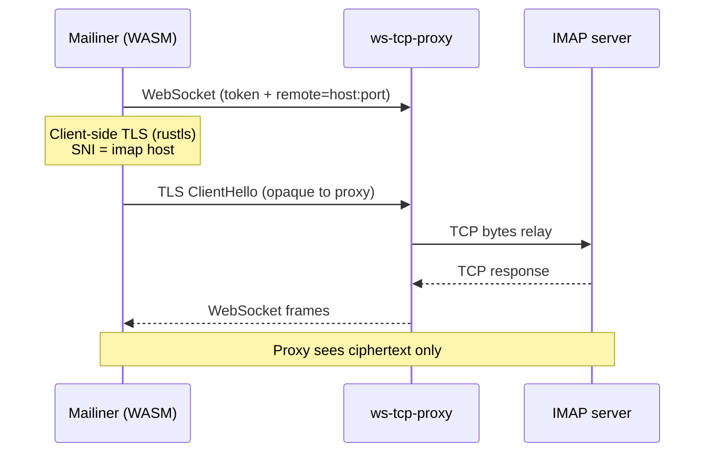
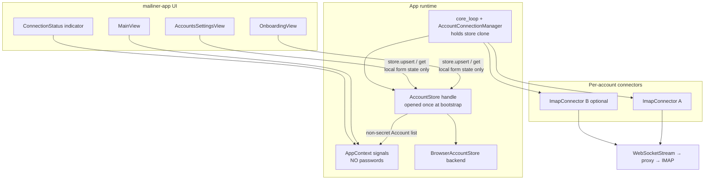
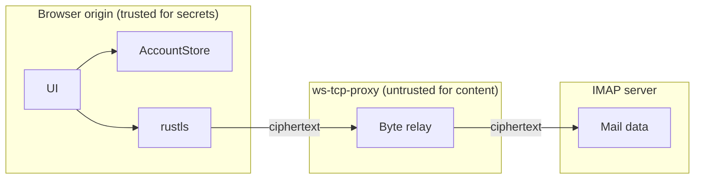

# Onboarding Page & Account Management for Mailiner

| Field | Value |
|-------|-------|
| **Title** | Onboarding Page & Account Management for Mailiner |
| **Author** | TBD |
| **Date** | 2026-07-24 |
| **Status** | Draft (rev 3 — post-save failure + dev_default bootstrap) |
| **Audience** | Senior engineers familiar with the Mailiner codebase |

---

## Overview

Mailiner currently connects to a single hard-coded IMAP server on startup: password from `env!("IMAP_PASSWORD")` (injected by `build.rs`), WebSocket proxy URL, host, and username all literals in `core_loop`. Connect/auth failures use `.expect(...)`, which **panics the core coroutine** (the Dioxus UI shell may keep rendering an empty mailbox chrome depending on WASM panic hook behavior — it is not a clean process abort). A dummy `Account` is seeded in `main.rs`. This is unsuitable for real use and blocks multi-account.

This design replaces compile-time credentials with a first-run **onboarding** flow, **browser-local account configuration storage**, and an **account management** UI. It introduces a multi-account-ready **connection manager** keyed by `AccountId`, soft failure for **all** connector calls in `core_loop`, explicit store ownership, test-connect / save-connect events, connect timeouts, and routing with a bootstrap UI state machine. v1 ships a fully working single-account path; the data model and connection manager make concurrent multi-account a natural extension rather than a rewrite.

---

## Background & Motivation

### Current state

| Location | Behavior |
|----------|----------|
| [`crates/mailiner-app/src/core_event.rs`](crates/mailiner-app/src/core_event.rs) | `core_loop` hard-codes password, `ws://localhost:9400/proxy?token=testtoken&remote=dvratil.cz:993`, host `"dvratil.cz"`, username `"me@dvratil.cz"`. Connect + authenticate with `.expect(...)` — panics the **core coroutine** on failure. `SelectAccount` still does `list_folders(...).await.unwrap()`. Single global `ImapConnector`. |
| [`crates/mailiner-app/build.rs`](crates/mailiner-app/build.rs) | Injects `IMAP_PASSWORD` via `cargo:rustc-env` from dotenv / environment. |
| [`crates/mailiner-app/src/main.rs`](crates/mailiner-app/src/main.rs) | Seeds account id `"1"`, name `"Valhalla"`, email `"me@dvratil.cz"`. Single route `Route::MainView` at `/`. Immediately sends `CoreEvent::SelectAccount`. |
| [`crates/mailiner-app/src/account.rs`](crates/mailiner-app/src/account.rs) | Thin UI wrapper: `Account { id, name, email }` re-exporting core `AccountId`. |
| [`crates/mailiner-app/src/websocket_stream.rs`](crates/mailiner-app/src/websocket_stream.rs) | Wraps browser `WebSocket` as `AsyncRead`/`AsyncWrite`. `WebSocket::new` panics on invalid URL; `onerror` only logs; `poll_write` waits forever if socket never reaches `OPEN`. Proxy URL embeds `token` and `remote=host:port`. |
| [`crates/mailiner-app/src/send.rs`](crates/mailiner-app/src/send.rs) | Outbound is a **stub** (`StubTransport`); SMTP not implemented. Composer already maps selected account → `FromIdentity`. |

### What already exists for multi-account

- `mailiner_core::models::Account` — `id`, `name`, `email`, timestamps (no connection settings).
- `Storage` trait — `save_account` / `list_accounts` / `delete_account` (mail cache oriented; `InMemoryStorage` only).
- `AppContext.accounts: Signal<HashMap<AccountId, Account>>` and `selected_account`.
- `CoreEvent::SelectAccount(AccountId)` — clears mailbox UI and lists folders, but does **not** create/switch connectors.
- Navigation header shows `account.name` ([`navigationheader.rs`](crates/mailiner-app/src/components/emailnavigation/navigationheader.rs)) — display only; **no click handler today**.
- Composer `identity_from_ctx` maps selected account → `FromIdentity`.

### Known connector debt: AccountId inconsistency

Verified in [`mailiner-imap-connector`](crates/mailiner-imap-connector/src/lib.rs):

| Path | `AccountId` used |
|------|------------------|
| `authenticate` return value | `AccountId::new(format!("imap-{}", username))` |
| Envelope construction | `AccountId::new(self.username.clone())` |
| `list_folders` | Caller-provided `account_id` argument |
| App seed today | `"1"` |

**Decision for v1:** The app owns stable UUID `AccountId`s. Folder/message UI is scoped to the selected account’s in-memory maps, so wrong `envelope.account_id` does **not** break v1 browsing. **However**, any future offline cache or multi-account envelope map keyed by `envelope.account_id` will be wrong until fixed.

**Follow-up (small PR, can ride with PR2 or immediately after):** store app `AccountId` on `ImapConnector` (constructor param) and use it for all envelope/`Account` fields the connector emits. Ignore the id returned from `authenticate` for app identity. Documented as known debt — not silently ignored.

### Pain points

1. **Developer-only credentials** — rebuild required to change password; secrets in build artifacts.
2. **Panic-on-connect (and LIST)** — coroutine aborts; empty chrome instead of recoverable error UI.
3. **No user path to add an account** — cannot demo or ship without source edits.
4. **Single connector** — `SelectAccount` cannot switch connections; multi-account is UI-shaped only.
5. **No browser persistence** — accounts, settings, and credentials vanish on refresh (except dummy seed).
6. **Proxy config invisible** — token and remote endpoint not user-configurable (important for self-hosted proxy).
7. **Hung WebSocket** — no timeout if proxy never opens; soft-fail is incomplete without it.

### Connection topology (unchanged)



Note: `ImapConnector` stores `port` but **never uses it** for I/O — the transport is always the supplied stream. Host is used for TLS SNI (`ServerName`). The IMAP TCP destination is entirely in the proxy query string (`remote=`). Design must treat **proxy remote** and **TLS SNI host** as related but distinct fields (usually equal).

---

## Goals & Non-Goals

### Goals

1. **First-run onboarding** — empty account store → **single-page** guided form for IMAP settings; validate by live connect/auth before (or as part of) persisting.
2. **Persist account configs in the browser** across reloads (including credentials under an explicit threat model and onboarding disclosure).
3. **Account management UI** — list / add / edit / remove accounts; switch active account.
4. **Resilient connection lifecycle** — no panic on **any** connector call in `core_loop`; connection state in UI; reconnect; connect **timeout**; failures surface as messages.
5. **Routing** — onboarding vs main app; bootstrap UI state machine; redirect when no accounts.
6. **Remove hard-coded / build-time credentials** — delete `IMAP_PASSWORD`, simplify or remove `build.rs` inject (debug-only form prefill may remain).
7. **Multi-account-ready architecture** — connection manager map by `AccountId`; v1 keeps only the active account connected.
8. **SMTP config fields** in the account model so send path can grow without schema churn; SMTP **UI hidden or clearly labeled “sending not implemented”** until PR8; transport remains stub.
9. **Security & privacy** aligned with Mailiner: credentials and mail stay client-side; proxy only relays bytes; operational disclosures in UI.

### Non-Goals (this design / v1 implementation series)

- Server-side user accounts, OAuth2/XOAUTH2, or mailiner.com identity.
  - **Onboarding copy (v1):** “Use your IMAP username and password (or provider app password). OAuth sign-in is not supported yet.”
- Full concurrent multi-account background sync for all accounts (design for it; implement active-account-first).
- Implementing real SMTP / IMAP APPEND send transport (config only).
- Offline mail cache persistence (IndexedDB for envelopes/parts) — separate effort.
- Autodiscover (Mozilla ISPDB / SRV / `.well-known`) — optional later; onboarding is manual fields first.
- Desktop OS keychain / Credential Management API as required path.
- Changing ws-tcp-proxy protocol (URL shape stays `?token=&remote=`).
- End-to-end encryption of mail content at rest beyond browser origin isolation.
- Full Content-Security-Policy rollout as a hard gate on PR5 (see Security — **minimal CSP is scheduled**, not “someday”).

---

## Proposed Design

### High-level architecture



### Ownership model (load-bearing)

| Object | Owner | Lifetime | Secrets? |
|--------|-------|----------|----------|
| `BrowserAccountStore` (or trait object) | Opened once in `App` bootstrap | Process / tab lifetime | Yes (reads/writes) |
| Store handle clone | Passed into `core_loop` **and** available via Dioxus context / `use_context` for settings/onboarding | Same | Yes |
| `AppContext.accounts` | UI signals | Always | **No passwords** — only `Account { id, name, email }` |
| Form local state | Onboarding / edit component `use_signal` | Form mount | Transient password fields |
| `AccountConnectionManager.configs` | `core_loop` only | Until disconnect/delete | Yes — for reconnect without re-fetch; drop on delete/disconnect |
| `ImapConnector` internal password | Connector instance | Until drop | Yes — zeroize follow-up later |

**Hard rules:**

1. **Never** put `imap.password`, `smtp.password`, or proxy `token` into `AppContext` signals.
2. UI loads secrets only via `store.get(id)` into **component-local** state for edit forms.
3. `core_loop` obtains configs primarily via **`store.get` / `store.list`**, not by re-broadcasting full secrets on every event.
4. On account **delete** or **disconnect**: drop connector (best-effort `disconnect`/logout), remove manager map entries (connector + config), clear connection state.

### Module layout (new / changed)

| Path | Role |
|------|------|
| `crates/mailiner-app/src/account_config.rs` | `AccountConfig`, `ImapSettings`, `SmtpSettings`, `ProxySettings`, URL builder |
| `crates/mailiner-app/src/account_store.rs` | `AccountStore` trait, `InMemoryAccountStore`, `BrowserAccountStore` |
| `crates/mailiner-app/src/connection.rs` | `ConnectionState`, `ConnectError`, `AccountConnectionManager`, timeouts |
| `crates/mailiner-app/src/components/onboarding.rs` | First-run form UI |
| `crates/mailiner-app/src/components/accounts.rs` | Settings: list / add / edit / remove |
| `crates/mailiner-app/src/components/connection_status.rs` | Connection indicator (minimal in PR5; polish in PR7) |
| `crates/mailiner-app/src/account.rs` | UI `Account` + map from config (no secrets) |
| `crates/mailiner-app/src/core_event.rs` | Lifecycle events; soft-fail all connector ops; manager |
| `crates/mailiner-app/src/main.rs` | Routes, `AppBootstrapState`, store open, no dummy seed |
| `crates/mailiner-app/build.rs` | Remove `IMAP_PASSWORD` inject (PR5) |
| `crates/mailiner-core` | Domain `Account` only; no passwords |

---

### Data model

```rust
// crates/mailiner-app/src/account_config.rs

use mailiner_core::ids::AccountId;
use chrono::{DateTime, Utc};
use serde::{Deserialize, Serialize};

/// Schema version for migrations of persisted blobs.
pub const ACCOUNT_STORE_SCHEMA_VERSION: u32 = 1;

#[derive(Debug, Clone, Serialize, Deserialize)]
pub struct AccountConfig {
    pub id: AccountId,
    /// User-visible label (e.g. "Work", "Valhalla").
    pub display_name: String,
    /// Primary mailbox address (From: / identity).
    pub email: String,
    pub imap: ImapSettings,
    /// Optional until send is implemented; persisted for forward-compat.
    /// v1 UI: hidden until PR8, or shown with "Sending not implemented" note.
    pub smtp: Option<SmtpSettings>,
    pub proxy: ProxySettings,
    pub created_at: DateTime<Utc>,
    pub updated_at: DateTime<Utc>,
}

#[derive(Debug, Clone, Serialize, Deserialize)]
pub struct ImapSettings {
    /// Hostname for TLS SNI and display (e.g. "imap.example.com").
    pub host: String,
    /// Nominal IMAP port (993). Used to build proxy `remote=` when
    /// `ProxySettings.remote_host/port` are unset; not used for direct TCP in WASM.
    pub port: u16,
    /// LOGIN username (often same as email).
    pub username: String,
    /// Password / app password. See Security section for at-rest handling.
    pub password: String,
    /// Reserved; v1 only supports implicit TLS over the proxy stream. Default true.
    pub use_tls: bool,
}

#[derive(Debug, Clone, Serialize, Deserialize)]
pub struct SmtpSettings {
    pub host: String,
    pub port: u16,
    pub username: String,
    /// If None, reuse IMAP password at send time.
    pub password: Option<String>,
    pub use_tls: bool,
}

#[derive(Debug, Clone, Serialize, Deserialize)]
pub struct ProxySettings {
    /// e.g. "ws://localhost:9400/proxy" or "wss://proxy.example/proxy"
    pub base_url: String,
    /// Shared secret for the proxy (`token` query param). Empty if proxy open.
    pub token: String,
    /// Override remote host for proxy (defaults to `imap.host`).
    pub remote_host: Option<String>,
    /// Override remote port for proxy (defaults to `imap.port`).
    pub remote_port: Option<u16>,
}

impl ProxySettings {
    /// Build full WebSocket URL for `WebSocketStream`.
    ///
    /// Encoding policy (decided):
    /// - Percent-encode `token` and `remote` host (and any non-unreserved chars)
    ///   using standard application/x-www-form-urlencoded / percent-encoding rules.
    /// - `remote` value is `host:port` with host encoded, port as decimal digits.
    /// - Reject empty IMAP/remote host before building (return `Err`).
    /// - Do not append a second `?` if `base_url` already has a query; use `&`.
    /// - Do not strip path; only trim a single trailing `/` on the path base if desired.
    /// - Scheme must be `ws` or `wss` (validate; reject `http`).
    ///
    /// Manual QA: confirm ws-tcp-proxy decodes percent-encoded tokens (Open Question retained
    /// only for server decode — client always encodes).
    pub fn websocket_url(&self, imap: &ImapSettings) -> Result<String, AccountConfigError> { /* ... */ }

    /// True when base_url is `ws://` and host is not localhost / 127.0.0.1 / ::1.
    pub fn is_insecure_remote_ws(&self) -> bool { /* ... */ }
}

impl AccountConfig {
    pub fn to_ui_account(&self) -> crate::account::Account {
        crate::account::Account {
            id: self.id.clone(),
            name: self.display_name.clone(),
            email: self.email.clone(),
        }
    }
}
```

**Serialization format (persistence):**

| Type | Format |
|------|--------|
| Whole config | `serde_json` object |
| `AccountId` | JSON string (newtype: `"uuid-…"`) |
| `DateTime<Utc>` | RFC 3339 string via `chrono` serde |
| Schema meta | `{ "schema_version": 1, "active_account_id": "…" \| null }` |

**AccountId generation:** `uuid::Uuid::new_v4()` → `AccountId::new(uuid.to_string())`. Do **not** use connector `imap-{username}` as stable app id.

**Defaults for onboarding form:**

| Field | Default |
|-------|---------|
| IMAP port | `993` |
| SMTP port | `465` (section hidden until PR8) |
| Proxy base URL | **Empty in release.** In `dev-defaults` / debug: `ws://localhost:9400/proxy` |
| Proxy token | empty (dev-defaults may prefill `testtoken`) |
| Production public proxy | **None by default** — user must enter proxy URL (self-host or documented public host when one exists). No hard-coded production proxy hostname in v1. |
| use_tls | `true` |

**Email → host heuristics (non-blocking):** if user enters `user@example.com` and leaves host empty, suggest `imap.example.com` as placeholder only.

---

### Credential & config persistence

#### AccountStore trait

```rust
// crates/mailiner-app/src/account_store.rs

use async_trait::async_trait;
use mailiner_core::ids::AccountId;
use crate::account_config::AccountConfig;

#[async_trait(?Send)] // WASM: single-threaded
pub trait AccountStore {
    async fn list(&self) -> Result<Vec<AccountConfig>, AccountStoreError>;
    async fn get(&self, id: &AccountId) -> Result<Option<AccountConfig>, AccountStoreError>;
    async fn upsert(&self, config: &AccountConfig) -> Result<(), AccountStoreError>;
    async fn delete(&self, id: &AccountId) -> Result<(), AccountStoreError>;
    async fn get_active_id(&self) -> Result<Option<AccountId>, AccountStoreError>;
    async fn set_active_id(&self, id: Option<&AccountId>) -> Result<(), AccountStoreError>;
}
```

Separate from `mailiner_core::Storage` (mail cache, no secrets).

#### Browser backend: localStorage-first, IndexedDB next

**Revised schedule risk mitigation:** correct async IndexedDB from raw `web-sys` is large. Prefer a **two-step persistence** path that still meets “persist across reloads”:

| Step | Backend | When |
|------|---------|------|
| **PR3a (primary for v1 ship)** | `localStorage` key `mailiner.accounts.v1` → single JSON blob `{ schema_version, active_account_id, accounts: [...] }` | Default path |
| **PR3b (optional follow-up)** | IndexedDB `mailiner` / store `accounts` + `meta` | When quota or multi-record indexing is needed |

**Fallback algorithm (PR3a):**

1. Try `window.localStorage`.
2. If unavailable (`SecurityError`, private mode quirks, quota): return `AccountStoreError::Unavailable`; UI shows `StoreError` bootstrap state with “storage blocked — accounts cannot be saved” and allow **session-only** in-memory store (warn: lost on refresh).
3. No dual-write. No automatic silent IDB fallback in v1 unless PR3b lands.

**localStorage size:** account configs are small (≪ 5MB). Acceptable for N accounts with passwords.

**PR3 acceptance tests (required):**

- Round-trip `upsert` → `list` → `get` → `delete`
- `set_active_id` / `get_active_id`
- Schema version present after write
- Password field survives round-trip (unit test only; never log)
- `InMemoryAccountStore` used in pure Rust tests (no browser)

#### Cargo dependencies to add (`mailiner-app`)

```toml
serde = { version = "1", features = ["derive"] }
serde_json = "1"
async-trait = "0.1"
# web-sys already present; extend features as needed:
# "Storage", "IdbFactory", "IdbDatabase", ... (IDB only if PR3b)
# percent-encoding or manual encode for proxy URL (small; prefer `percent-encoding` crate if WASM-ok)
```

#### Password at rest (threat model)

| Threat | Severity | Mitigation |
|--------|----------|------------|
| XSS in Mailiner origin | Critical | Sanitize HTML (existing); **minimal CSP in PR5/PR7**; never `eval` user content |
| Malicious browser extension | High | Document residual risk; optional passphrase (v1.1) |
| Disk theft of browser profile | Medium | OS disk encryption; optional app passphrase |
| Proxy operator | Low for body | Client TLS; proxy sees destination + ciphertext |
| Multi-tab concurrent edits | Low–Medium | **Last-write-wins** on `upsert` / `set_active_id`; no cross-tab lock in v1 |
| DevTools inspection | Expected | Secrets visible to anyone with origin access — disclose in UI |
| Incognito / private mode | Expected | Storage may be ephemeral or blocked — show `StoreError` / session-only warning |
| Build pipeline leak | Eliminated | Remove `IMAP_PASSWORD` from builds |

**v1 default:** passwords in localStorage JSON (origin isolation only).

**v1.1 optional passphrase:** Web Crypto AES-GCM on password fields only; unlock once per session.

**v1 UI requirements (not optional):**

1. Onboarding disclosure (near Save):  
   *“Your IMAP password is stored only in this browser on this device. Mailiner has no server account. Anyone with access to this browser profile (or a compromised page on this origin) can read it. Use a private device; clear site data to remove it.”*
2. Settings → security note (same gist).
3. Shared-device copy: recommend browser profile lock / sign-out of shared PCs.
4. When `proxy.is_insecure_remote_ws()`: non-blocking warning — *“This proxy URL uses unencrypted WebSocket to a non-local host. The proxy token can be sniffed. Prefer `wss://`.”*
5. Logging: never log password, token, or full proxy URL with token.

---

### Connection lifecycle & multi-connector manager

#### Connection state

```rust
// crates/mailiner-app/src/connection.rs

#[derive(Debug, Clone, PartialEq, Eq)]
pub enum ConnectionState {
    Idle,
    Connecting,
    Authenticating,
    Ready,
    Error { message: String, kind: ConnectErrorKind, retryable: bool },
    Disconnected,
}

#[derive(Debug, Clone, Copy, PartialEq, Eq)]
pub enum ConnectErrorKind {
    NetworkOrProxy,
    TlsOrSni,
    Auth,
    Timeout,
    Cancelled,
    Internal,
}

#[derive(Debug, Clone)]
pub struct ConnectError {
    pub kind: ConnectErrorKind,
    pub message: String, // user-safe
    pub retryable: bool,
}
```

`AppContext.connection_states: Signal<HashMap<AccountId, ConnectionState>>` — no secrets.

#### Timeouts, cancel, WebSocket readiness (required)

| Parameter | Value |
|-----------|-------|
| Overall connect budget (WS open + TLS + LOGIN) | **20 seconds** wall clock |
| Per-phase optional split | WS open ≤ 10s; TLS+IMAP greeting ≤ 10s; LOGIN ≤ 10s (still capped by overall 20s) |
| On timeout | `ConnectionState::Error { kind: Timeout, retryable: true }`; drop stream/connector |
| On user navigate away from test | Drop test future; no map pollution |

**`WebSocketStream` changes (PR2, not optional polish):**

1. `WebSocketStream::try_new(url) -> Result<Self, io::Error>` — no panic on bad URL.
2. Track ready state: `Connecting | Open | Error | Closed`.
3. `onerror` / abnormal `onclose` → set error; wake read/write waiters with `Err`.
4. `poll_write` / `poll_read` after error → `Err(NotConnected)` / `BrokenPipe`, **not** perpetual `Pending`.
5. Optional: `wait_until_open(timeout) -> Result<()>` used before `connector.connect`.

Connect sequence must **race** against `gloo_timers` (already a dependency) timeout future.

#### AccountConnectionManager

Owned solely by `core_loop` (single-task; avoids `Send` issues with `SendWrapper`):

```rust
struct AccountConnectionManager {
    connectors: HashMap<AccountId, ImapConnector<WebSocketStream>>,
    /// Cached configs for reconnect; dropped on delete/disconnect.
    configs: HashMap<AccountId, AccountConfig>,
    /// Generation counter for switch debounce / stale result ignore.
    connect_generation: HashMap<AccountId, u64>,
    store: std::rc::Rc<dyn AccountStore>, // or concrete type
}
```

**In-memory secret copies (v1 max):**

1. Store backend (localStorage / memory)
2. Manager `configs` entry while connected or selected for reconnect
3. `ImapConnector` internal password field
4. Transient: event payload for `TestConnection` / `CommitNewAccount` (dropped after handling)
5. Form local state while editing

On delete/disconnect: remove (2)+(3); (1) deleted on user delete; (4)(5) short-lived. Zeroize is a later hardening PR; residual heap copies until then are accepted and documented.

#### Switch debounce / stale connects

- Each `ensure_connected` / `SelectAccount` bumps a generation for that account (and a global “selected generation”).
- When connect future completes, if `selected_account != target` or generation mismatch → drop connector, do not update UI to Ready for the stale account.
- Rapid account switches: cancel or ignore previous connect; **no reconnect storm** — at most one in-flight connect for the active account.
- Optional 150–300ms debounce on UI switch clicks (PR6).

**Rough WASM memory budget (guidance):** one active IMAP+TLS session ≈ order of low hundreds of KB to a few MB peak with FETCH buffers (existing stream chunk 512 KiB). Active-only policy keeps this to **one** such session. Do not keep N warm connectors in v1.

#### Soft-fail: entire `core_loop` surface (PR2 acceptance)

**Not only connect/auth.** Every connector call maps to UI state; **no `.unwrap()` / `.expect()` on connector results** in `core_loop`:

| Event | On error |
|-------|----------|
| Connect / auth | `ConnectionState::Error` |
| `list_folders` | `ConnectionState` or `action_status`; empty mailbox tree; log |
| `open_folder` | already mostly soft — keep |
| `list_envelopes_range` | already soft — keep |
| `load_message` | already soft — keep |
| `update_envelope_flags` / `move_messages` / download | already soft — keep |

#### CoreEvent surface (complete)

```rust
pub enum CoreEvent {
    // —— existing mail ops ——
    SelectMailbox(MailboxId),
    FetchMessageRange { mailbox_id: MailboxId, range: Range<usize> },
    SelectMessage(MessageId),
    MarkAsRead { mailbox_id: MailboxId, message_ids: Vec<MessageId> },
    MoveToTrash { mailbox_id: MailboxId, message_ids: Vec<MessageId> },
    DownloadAttachment { /* … */ },

    /// Select account for UI + ensure connector + list folders.
    /// Loads config from store by id (must already be persisted).
    SelectAccount(AccountId),

    /// After store open: seed manager awareness; connect active if present.
    /// Prefer **not** embedding Vec<AccountConfig> secrets on the channel once
    /// core_loop holds the store — pass only active id (or None).
    /// Transition variant during PR2 may pass ids only:
    Bootstrap { active: Option<AccountId> },

    /// Unsaved form: connect, report state under ephemeral key, disconnect, do not persist.
    TestConnection {
        /// Ephemeral id for ConnectionState map / UI correlation (not stored).
        request_id: AccountId, // or a dedicated RequestId newtype
        config: AccountConfig, // may use temporary id == request_id
    },

    /// **First-run / add-account commit (connect-before-persist).**
    /// Core connects with `config` (not yet required in store). On `Ready` only:
    /// `store.upsert`, `set_active_id`, keep connector, list folders.
    /// On failure: **no store write**; leave `ConnectionState::Error` for `config.id`.
    /// UI must stay on onboarding/new-account form until Ready (see sequence (b)).
    CommitNewAccount { config: AccountConfig },

    /// Account already in store (cold start, switch, PR6 edit that already upserted).
    /// Load via `store.get`, connect, list folders on Ready.
    ConnectExisting { account_id: AccountId },

    Reconnect { account_id: AccountId },

    DisconnectAccount(AccountId),

    /// UI mutated store (edit/delete without a full commit). Manager drops deleted
    /// connectors; does not auto-connect unless followed by `ConnectExisting` / `SelectAccount`.
    AccountsChanged,
}
```

> **Note:** Earlier draft name `SaveAndConnect { account_id }` is replaced by the pair
> `CommitNewAccount` (connect-before-persist) and `ConnectExisting` / `SelectAccount`
> (already persisted). Do not reintroduce upsert-then-navigate-on-auth-failure for first save.

##### Test connection semantics

1. UI builds `AccountConfig` with a **new UUID** as `request_id` (or form uses random id only for the test).
2. Send `TestConnection { request_id, config }`.
3. Manager does **not** insert into long-lived `connectors` under a real account id that could collide; use a side slot `test_connector: Option<…>` or key only by `request_id` and **always remove** after success/fail/timeout.
4. Set `connection_states[request_id]` through Connecting → Authenticating → Ready/Error.
5. On Ready: immediately disconnect and remove; UI shows “Connection successful”.
6. Do **not** call `store.upsert`.
7. UI correlates via `request_id` signal / status string `test_status: Signal<Option<TestResult>>` on context **without** password.

##### Save & continue sequence (onboarding) — connect-before-persist

**Decision (PR5 acceptance):** never persist a first account until IMAP reachability + LOGIN succeed. Auth typos must not land the user on main without an edit path (settings UI is PR6).

Ordered sequence:

1. Generate UUID `account_id` if new; keep full `AccountConfig` in **form-local state only**.
2. Disable Save; show “Connecting…”.
3. `tx.send(CoreEvent::CommitNewAccount { config })` — **no prior `store.upsert`**.
4. Core:
   - `ensure_connected` with event `config` (same timeout/WS rules as Test).
   - **On `ConnectErrorKind::Auth` / Timeout / Network / TLS:** set `connection_states[config.id] = Error { … }`; **do not** `upsert` or `set_active_id`; drop connector.
   - **On Ready:** `store.upsert(&config)` → `store.set_active_id(Some(&id))` → keep connector in map → `list_folders` (soft-fail) → mailbox tree side effects as today’s `SelectAccount`.
5. UI watches `connection_states` for `config.id`:
   - **Error:** stay on `/onboarding` (or `/settings/accounts/new`); form fields **preserved** so the user can fix password/host/proxy; show kind-specific copy (Auth ≠ generic Retry-only). Bootstrap remains `NeedsOnboarding` until a successful commit.
   - **Ready:** refresh `AppContext.accounts` from `store.list()` → `to_ui_account()` only; set `AppBootstrapState::Ready`; `navigator().replace(Route::MainView {})`.
6. Optional: user may click **Test connection** first (ephemeral); Save still runs full `CommitNewAccount` (does not require a prior successful Test, but UX may soft-encourage it).

**PR6 add-account** (`/settings/accounts/new`) uses the same `CommitNewAccount` path.

**PR6 edit existing (non-secret fields):** UI may `store.upsert` immediately + `AccountsChanged`.

**PR6 edit credentials (password/host/proxy):** prefer connect-before-persist variant: try connect with draft config → upsert only on Ready (same as commit); on failure keep old store config intact and show form error.

**Folder listing trigger:** after `Ready` inside `CommitNewAccount` / `SelectAccount` / `ConnectExisting` — not a separate user event. If connect fails, do not LIST.

---

### Happy-path & edge-case sequences

| Scenario | Sequence | Folder load | Failure UI |
|----------|----------|-------------|------------|
| **(a) Cold start with accounts** | Open store → `AppBootstrapState::Ready` → populate `accounts` (no secrets) → resolve active (see recovery) → route `/` → `Bootstrap { active }` → `ensure_connected` → LIST folders | After Ready | Connection badge + Retry; mail chrome visible |
| **(b) Cold start empty → onboarding → save** | Open store → empty → `NeedsOnboarding` → `/onboarding` → optional Test → **`CommitNewAccount` (connect-before-persist)** → on Ready: upsert + active + LIST + navigate main; on Error: **stay on onboarding**, form preserved, no store write | After commit Ready | Kind-specific inline errors (Auth/Timeout/Network/TLS). **No** navigate-to-main-without-edit-path. Storage failure on upsert after Ready: stay onboarding, show store error, connector may disconnect. |
| **(c) Account switch** | UI sets selected + `set_active_id` → `SelectAccount(new)` → disconnect previous (v1) → connect new → clear mailbox UI → LIST | After new Ready | Previous disconnected; new Error state if fail |
| **(d) Reload** | Same as (a) | Same | Same |
| **(e) Delete non-last account** | Confirm → `store.delete` → if was active, set active to another → `AccountsChanged` + maybe `SelectAccount` | As switch | — |
| **(f) Delete last account** | Confirm → delete → `set_active_id(None)` → clear signals → disconnect all → navigate `/onboarding` | N/A | — |
| **(g) active_id missing / stale** | If `get_active_id` is `None` or id not in list → **pick first account by `created_at` ascending**, `set_active_id`, continue (a). Never block on a picker in v1. | As (a) | Log warning |
| **(h) Store open failure** | `AppBootstrapState::StoreError` → full-page message; optional session-only continue | N/A until resolved | Cannot persist |

---

### Routing & bootstrap UI

```rust
#[derive(Debug, Clone, Routable, PartialEq)]
#[rustfmt::skip]
enum Route {
    #[layout(AppShell)]
    #[route("/")]
    MainView {},
    #[route("/onboarding")]
    OnboardingView {},
    #[route("/settings/accounts")]
    AccountsSettingsView {},
    /// Add account (full page form, reuses onboarding fields).
    #[route("/settings/accounts/new")]
    AccountNewView {},
    #[route("/settings/accounts/:id")]
    AccountEditView { id: String },
}
```

**Deep-link story (pinned):**

- **Add account:** always `/settings/accounts/new` (full page), not a modal.
- **Edit:** `/settings/accounts/:id`.
- **List:** `/settings/accounts`.
- Zero accounts + any `/settings/*` → redirect `/onboarding`.
- Non-empty + `/onboarding` → redirect `/` (add account uses `/settings/accounts/new`, not onboarding).
- Drop the vague `?force=1` escape hatch.

#### `AppBootstrapState`

```rust
#[derive(Clone, Debug, PartialEq)]
pub enum AppBootstrapState {
    /// Store open + list in flight. Show full-page spinner; do NOT mount MainView mail chrome.
    LoadingStore,
    /// Zero accounts. Only onboarding route is valid.
    NeedsOnboarding,
    /// Accounts loaded; main app allowed.
    Ready,
    /// localStorage/IDB unavailable.
    StoreError { message: String },
}
```

Owned by `App` as a `Signal` (or resource). **Guards:**

1. While `LoadingStore`: render only loading shell; **do not** start `SelectAccount` / connect; `core_loop` may be spawned but idle until `Bootstrap`.
2. Transition to `NeedsOnboarding` | `Ready` | `StoreError` exactly once after first load (later account deletes can move Ready → NeedsOnboarding).
3. Navigation: `use_effect` / post-load logic calls `navigator().replace(...)` — prefer **replace** for guards to avoid back-stack traps.

**AppShell chrome:**

| State / route | Toolbar / FAB / mailbox chrome |
|---------------|--------------------------------|
| LoadingStore, StoreError, OnboardingView | **Hidden** — minimal full-page layout |
| MainView, settings (Ready) | Normal chrome; settings may hide FAB |

**Entry points to settings (concrete):**

1. PR6: make navigation header account name a **button** → `/settings/accounts`.
2. PR6: optional gear `IconButton` on toolbar → same.
3. Until PR6, onboarding is the only account UX (PR5).

**Mechanism note:** use Dioxus `use_resource` or async `use_future` in `App` to open store; set bootstrap state; provide store via `use_context_provider`. Router renders under shell that reads bootstrap state.

#### Bootstrap resolution algorithm (including interim `dev_default`)

Run once after store open (and again after last-account delete):

```text
match store.list() {
  Err(e) if unavailable => AppBootstrapState::StoreError { … }

  Ok(accounts) if !accounts.is_empty() => {
      AppBootstrapState::Ready
      // populate UI accounts (no secrets); resolve active_id (stale → first by created_at)
      // route away from /onboarding if needed; CoreEvent::Bootstrap { active }
  }

  Ok([]) => {
      // —— interim only (PR2–PR4), not PR5+ release empty-store path ——
      #[cfg(any(debug_assertions, feature = "dev-defaults"))]
      if let Some(cfg) = dev_default_config() {
          // 1) Treat as Ready — do NOT set NeedsOnboarding, do NOT route to /onboarding
          // 2) Populate AppContext.accounts with cfg.to_ui_account() only
          // 3) Hold cfg in manager/core memory for connect (see below)
          // 4) CoreEvent::Bootstrap with synthetic active id == cfg.id
          //    OR connect via in-memory path equivalent to ConnectExisting without store
          // 5) Do NOT store.upsert / do NOT write localStorage
          //    unless feature "dev-defaults-persist" (optional, default off)
          AppBootstrapState::Ready
          return;
      }

      AppBootstrapState::NeedsOnboarding
      // navigator.replace(OnboardingView); no auto-connect
  }
}
```

**Hard rules for `dev_default_config()`:**

| Rule | Detail |
|------|--------|
| When | Store list is **empty** and `dev_default_config()` returns `Some` and `debug_assertions` or feature `dev-defaults` |
| Bootstrap state | **`Ready`**, not `NeedsOnboarding` |
| Routing | Main app (`/`); **skip** onboarding entirely |
| UI accounts | Synthetic entry from `to_ui_account()` in memory |
| Persistence | **No** localStorage write by default (secrets stay in process memory / env-derived config only) |
| Connect | Soft-fail `ensure_connected` with that config; same timeout/WS rules |
| PR5 | Remove empty-store auto-connect; `dev-defaults` may still **prefill onboarding form placeholders** only |

This eliminates the dual-path where onboarding placeholder is shown while a background connect uses hard-coded/dev credentials.

---

### UI design

#### Onboarding (`OnboardingView`) — single page (not multi-step wizard)

One scrollable form with sections:

1. Identity — display name, email  
2. IMAP — host, port, username, password  
3. Proxy — base URL, token (advanced `<details>`; prefilled only with `dev-defaults`)  
4. SMTP — **hidden until PR8**; if shown early, disabled note: “Sending is not implemented yet”

Actions:

- **Test connection** → `TestConnection` event; button disabled while in flight; show success/error by kind  
- **Save & continue** → `CommitNewAccount` (connect-before-persist); **stay on this page until Ready**; never navigate to main with only Retry after Auth error  

Also show: password storage disclosure; `ws://` non-local warning; app-password / no-OAuth note.

#### Account management (`AccountsSettingsView`)

- List: display name, email, host, connection badge for active  
- Switch / Edit / Delete (confirm)  
- Add → `/settings/accounts/new`  
- Last delete → onboarding  

#### Connection chrome

- **PR5 minimum:** onboarding result text + main-view status line / simple badge when `Error` or `Connecting`  
- **PR7 polish:** toolbar indicator, tooltip, Retry button styling  

---

### Migration off hard-coded credentials

1. Delete `env!("IMAP_PASSWORD")` usage (PR5).  
2. Remove `build.rs` inject + dotenv build-dep if unused.  
3. Remove dummy account seed (aligned with PR4/PR5 runnable story — see PR plan).  
4. README:

```text
1. cargo run -p ws-tcp-proxy   # separate repo
2. dx serve -p mailiner-app --features dev-defaults   # optional prefill
3. Open app → Onboarding → enter IMAP + proxy (token e.g. testtoken)
```

5. **`dev-defaults` feature:** form **placeholders only** from `option_env!("MAILINER_DEV_*")` — never auto-connect, never inject into release without feature.

**Interim dev connect (PR2–PR4 only):**

```rust
#[cfg(any(debug_assertions, feature = "dev-defaults"))]
fn dev_default_config() -> Option<AccountConfig> { /* option_env fields; None if unset */ }
```

See **Bootstrap resolution algorithm** above for the exact interaction with `AppBootstrapState`. Summary: empty store + `Some(dev_default)` ⇒ **`Ready` + main + in-memory account + connect**, not onboarding; **no** persistence unless optional `dev-defaults-persist`. PR5 removes empty-store auto-connect; onboarding becomes the only empty-store path (form prefill via `dev-defaults` still allowed).

---

### SMTP / sending

- Schema: optional `SmtpSettings` from PR1.  
- **PR5 onboarding:** do **not** show SMTP fields.  
- **PR8:** show advanced SMTP with permanent note: “Sending is not implemented; these settings are saved for a future release.”  
- Composer continues `StubTransport` until a future SMTP PR.

---

### Multi-account phasing

| Phase | UX | Connections | Store |
|-------|----|-------------|-------|
| **P0** | Single account via onboarding | One connector | localStorage list of 1 |
| **P1** | Add/remove/switch in settings | Active-only | N configs, 1 active |
| **P2** | Switcher + optional folder cache | Optional multi-connector | Same |
| **P3** | Background idle secondaries | Cap N connectors | Same |

---

## API / Interface Changes

### Before (startup)

```rust
let password = env!("IMAP_PASSWORD").to_string();
let websocket_stream = WebSocketStream::new(
    "ws://localhost:9400/proxy?token=testtoken&remote=dvratil.cz:993",
);
let connector = ImapConnector::new(/* hard-coded */);
connector.connect(websocket_stream).await.expect("...");
connector.authenticate(password.as_str()).await.expect("...");
// SelectAccount: list_folders(...).unwrap()
```

### After (startup)

```rust
// App
let store = Rc::new(BrowserAccountStore::open().await?);
use_context_provider(|| store.clone());
// load list → AppBootstrapState → navigate
let tx = use_coroutine({
    let store = store.clone();
    move |rx| core_loop(rx, ctx, store)
});
tx.send(CoreEvent::Bootstrap { active });

// core_loop
// no hard-coded credentials; manager.ensure_connected loads store.get(id)
// TestConnection / CommitNewAccount / SelectAccount / ConnectExisting as specified
```


### ImapConnector follow-up

```rust
// Preferred small change (PR2 or follow-up):
ImapConnector::new(app_account_id, host, port, username, password)
// envelopes use app_account_id
```

---

## Data Model Changes

### Persisted schema (localStorage JSON v1)

```json
{
  "schema_version": 1,
  "active_account_id": "550e8400-e29b-41d4-a716-446655440000",
  "accounts": [ { "id": "…", "display_name": "…", "email": "…", "imap": { }, "smtp": null, "proxy": { }, "created_at": "…", "updated_at": "…" } ]
}
```

### Migrations

- `schema_version` in blob; pure `migrate_vN_to_vN+1` functions.  
- v1 has no prior user data from env credentials.

---

## Alternatives Considered

### 1. Keep build-time env credentials with runtime override

- **Rejected** as primary; `dev-defaults` form prefill only.

### 2. Put full AccountConfig into mailiner_core + Storage

- **Rejected** — secrets ≠ mail cache; WASM persistence is app concern.

### 3. Always encrypt passwords with forced passphrase

- **Deferred** to optional v1.1.

### 4. Concurrent connectors from day one

- **Deferred** to P2; structure still multi-key map.

### 5. Server-backed account vault

- **Rejected** — contradicts privacy model.

### 6. localStorage-only v1 vs IndexedDB-first

- **Chosen: localStorage-first (PR3a)** for schedule risk; IDB as PR3b when needed.  
- **Pros of localStorage:** tiny API surface, sync-friendly in WASM glue, enough quota for configs.  
- **Cons:** 5MB limit, sync main-thread, single blob — fine for account configs.  
- **IDB-first** remains better long-term for offline mail cache (separate project).

### 7. Single global connector + swap config vs HashMap manager

- **Rejected as end state:** swap-in-place works for v1 single account but forces a rewrite for multi-account and complicates test-connect isolation.  
- **HashMap manager** with 0..=1 live entries is the same cost as one global connector today, with clear keys for test/ephemeral and future N.

### 8. sessionStorage / cookies for secrets

- **Rejected:** cookies go to network on requests (wrong); sessionStorage dies every tab close (bad UX for a mail client). localStorage/IDB match “remember this browser”.

### 9. Credential Management API in v1

- **Deferred:** patchy WASM/browser support; optional enhancement later. Browser password manager via `autocomplete` on inputs still works.

### 10. App-global proxy vs per-account proxy

- **Chosen: per-account** (with form defaults copying last-used proxy for convenience).  
- **Global proxy** would be simpler for “everyone uses one Mailiner proxy” but fails for mixed self-hosted / provider setups and multi-identity power users. Per-account matches Thunderbird-style accounts.

---

## Security & Privacy Considerations

### Trust boundaries



### Rules

1. Credentials never leave the origin except inside IMAP/SMTP TLS to the mail server (via proxy as opaque TCP).  
2. Proxy token is sensitive — storage + no logs.  
3. TLS SNI reveals IMAP hostname to proxy (inherent).  
4. No IMAP password in URL query.  
5. XSS = game over for local secrets → sanitize + **CSP baseline**.  
6. Delete account wipes storage entry + in-memory maps.  
7. `autocomplete="current-password"` on password fields.  
8. Multi-tab: last-write-wins; document in settings help.  
9. Warn on non-local `ws://` proxy URLs.

### CSP baseline (scheduled)

- **PR5 or PR7:** ship a minimal CSP via `Dioxus.toml` / meta / headers for the static host: default-src 'self'; script-src 'self' (adjust for Dioxus WASM requirements); connect-src 'self' ws: wss: (may need to be broader for user proxies — document that user-entered proxy hosts require `connect-src *` or dynamic policy, which browsers limit).  
- **Reality check:** user-defined proxy hosts make a strict `connect-src` allowlist impossible without relaxing to `connect-src *` or https/wss wildcards. **Decision:** implement **as strict as Dioxus allows** for script/style/img; for `connect-src`, allow `ws:` `wss:` `http:` `https:` to user proxies (network still TLS-wrapped for IMAP). Goal is XSS script injection reduction, not blocking proxy diversity.  
- If hosting constraints block CSP in-app, track as explicit follow-up owned by deployment docs — still not “unplanned.”

---

## Observability

### ConnectError → UI + logs

| Kind | User string (example) | Log fields |
|------|----------------------|------------|
| NetworkOrProxy | “Could not reach the proxy or mail server. Check proxy URL and network.” | `kind`, `account_id`, `imap_host`, `proxy_base_host` (no token) |
| TlsOrSni | “Secure connection failed. Check IMAP hostname (certificate / SNI).” | same |
| Auth | “Sign-in failed. Check username and password.” | same; never password |
| Timeout | “Connection timed out. Try again or check proxy/IMAP host.” | same + `timeout_ms` |
| Cancelled | (usually silent) | debug |
| Internal | “Something went wrong connecting.” | error detail sanitized |

**Correlation:** `TestConnection.request_id` logged as `request_id` (not secret).

**Dev path without IMAP_PASSWORD:** README + `dev-defaults` feature for form prefill; optional anonymized “Copy diagnostics” later (host, kind, timestamp only) — not v1 required.

**Metrics / alerting:** none client-side in v1.

---

## Rollout Plan

1. **Ship-by-default** once PR5+ merges — **no** long-lived `account-management` compile flag required for end users.  
2. Optional features: `dev-defaults` only.  
3. No staged server rollout.  
4. Rollback: revert PRs; storage blob forward-compatible with `#[serde(default)]`.  
5. QA: empty store; one account; bad password; bad proxy; hung proxy (timeout); offline; delete last; reload; multi-tab last-write; account switch; `ws://` warning.

### Risks

| Risk | Severity | Mitigation |
|------|----------|------------|
| IDB complexity | Medium | localStorage-first PR3a |
| Hung WebSocket | High | Timeout + WS error surfacing in PR2 |
| Dual-path PR interim | Medium | Empty+dev_default ⇒ Ready/main (not onboarding); no store write; PR5 removes auto-connect |
| First-save bad password dead-end | High | Connect-before-persist; stay on onboarding until Ready (PR5) |
| Panic on LIST | High | Soft-fail all connector calls PR2 |
| Event/config race on switch | Medium | Generation / stale ignore |
| XSS → secret theft | Critical | Sanitize + CSP baseline |
| Multi-tab clobber | Low | Last-write-wins documented |

---

## Open Questions

1. ~~Production default proxy URL~~ → **Decided: none**; user enters URL. Update when a public proxy is productized.  
2. ~~Passphrase in v1?~~ → **v1.1**.  
3. Should “Test connection” also run LIST after LOGIN? → **Default yes for onboarding Test** (stronger health check); settings Test can be LOGIN-only for speed — implementer choice, prefer LIST for both if cheap.  
4. ~~OAuth messaging~~ → **Decided:** app-password / no-OAuth copy in onboarding.  
5. Account-scoped mailbox cache — **P2**, confirmed out of v1 PR series.  
6. Proxy server percent-decode of tokens — **client always encodes**; manual QA against ws-tcp-proxy; change proxy if needed.  
7. ~~First-save connect failure UX~~ → **Decided: connect-before-persist** via `CommitNewAccount`; stay on onboarding on failure; **no** upsert until Ready. (Supersedes earlier main+error draft.)

---

## Key Decisions

| Decision | Choice | Rationale |
|----------|--------|-----------|
| Config ownership | App-layer `AccountConfig` + `AccountStore` | Secrets ≠ mail cache |
| Store handle | Open once; `Rc` to UI context + `core_loop` | Single writer API; core reloads via `store.get` |
| Passwords in AppContext | **Never** | Reduce leak surface via signals/devtools of global state |
| Test-connect API | `CoreEvent::TestConnection { request_id, config }` ephemeral | Unsaved form must not require store id |
| First-save path | **`CommitNewAccount` = connect-before-persist**; stay on onboarding on failure | Avoids main-without-settings dead-end before PR6; bad passwords never stored |
| Existing-account connect | `SelectAccount` / `ConnectExisting` after store has config | Cold start + switch |
| Empty store + `dev_default` (PR2–PR4) | **`Ready` + main + memory-only account**; no onboarding; no localStorage write | Runnable IMAP without fighting NeedsOnboarding |
| Password at rest (v1) | localStorage JSON, origin-isolated | Schedule + honesty; passphrase later |
| Persistence backend | **localStorage first**, IDB later | IDB wrapper schedule risk |
| Connection policy v1 | Single active connector; map by `AccountId` | WASM memory |
| Soft-fail scope | **All** connector calls in `core_loop` | LIST still `.unwrap()` today |
| Connect timeout | 20s overall + WS error surfacing | Hung proxy otherwise |
| Failure handling | `ConnectionState` + kinds; no expect | Usable when misconfigured |
| Account IDs | UUID v4 app-owned | Stable; connector id debt fixed in follow-up |
| Connector envelope account_id | Pass app id into connector (follow-up) | Avoid username/`imap-` mismatch |
| Proxy URL | Always percent-encode token & host | Reserved characters |
| Proxy scope | Per-account (default-copy UX) | Mixed self-host setups |
| Production proxy default | **None** (empty field) | No surprise third-party hop |
| Onboarding UX | **Single page** form | Simpler than wizard; still “guided” sections |
| Feature flags | Ship-by-default; `dev-defaults` only | Avoid dual product modes |
| SMTP UI | Hidden until PR8; then labeled not implemented | Avoid false “send works” |
| CSP | Baseline in PR5/PR7; connect-src relaxed for user proxies | XSS mitigation without blocking proxies |
| Multi-tab | Last-write-wins | Simple v1 |
| Panic wording | Core **coroutine** panic, not always full process death | Accurate WASM behavior |

---

## References

- Project README — privacy model, ws-tcp-proxy  
- [`crates/mailiner-app/src/core_event.rs`](crates/mailiner-app/src/core_event.rs)  
- [`crates/mailiner-app/src/main.rs`](crates/mailiner-app/src/main.rs)  
- [`crates/mailiner-imap-connector/src/lib.rs`](crates/mailiner-imap-connector/src/lib.rs)  
- [`crates/mailiner-app/src/websocket_stream.rs`](crates/mailiner-app/src/websocket_stream.rs)  
- [`crates/mailiner-core/src/models.rs`](crates/mailiner-core/src/models.rs), [`storage.rs`](crates/mailiner-core/src/storage.rs)  
- [`crates/mailiner-app/src/send.rs`](crates/mailiner-app/src/send.rs)  
- [`crates/mailiner-composer/src/identity.rs`](crates/mailiner-composer/src/identity.rs)  
- AGENTS.md — WASM constraints  

---

## PR Plan

Each PR leaves `main` **buildable**. Runnable against real IMAP:

- **Through PR4:** via `dev_default_config()` when store empty + debug/`dev-defaults` (soft-fail), **or** manual store injection in tests.  
- **From PR5:** via onboarding; hard-coded secrets removed.

### PR1 — Account config model & in-memory store

- **Title:** `feat(accounts): AccountConfig model and AccountStore trait`
- **Files:** `account_config.rs`, `account_store.rs` (`InMemoryAccountStore`), module wiring, serde deps, unit tests (`websocket_url` encoding, serde dates/ids)
- **Dependencies:** none
- **Description:** Pure data + memory store. No UI/connection change.

### PR2 — Connection manager, soft-fail, timeouts, WebSocket readiness

- **Title:** `feat(accounts): AccountConnectionManager, soft-fail core_loop, connect timeout`
- **Files:** `connection.rs`, `core_event.rs`, `context.rs` (`connection_states`), `websocket_stream.rs` (`try_new`, error wake), optional `ImapConnector` app `AccountId` param
- **Dependencies:** PR1
- **Acceptance:**
  - No `.unwrap`/`.expect` on connector calls in `core_loop`
  - 20s connect timeout → `ConnectErrorKind::Timeout`
  - WS error/close fails connect (not infinite Pending)
  - `TestConnection`, `CommitNewAccount`, `ConnectExisting` / `SelectAccount`, `Bootstrap` implemented
  - **Interim:** empty store + `dev_default_config()` ⇒ `AppBootstrapState::Ready`, skip onboarding, memory-only account, soft-fail connect; **no** store write
- **Description:** Manager ownership; generation debounce; secrets not in AppContext; connect-before-persist for new accounts.

### PR3 — Browser persistence (localStorage)

- **Title:** `feat(accounts): BrowserAccountStore via localStorage`
- **Files:** `account_store.rs` implementation, `Cargo.toml` web-sys `Storage`, acceptance tests (wasm or abstracted), README storage note
- **Dependencies:** PR1
- **Demo/reviewability:** unit tests for JSON blob round-trip; optional `#[cfg(feature = "store-debug")]` console helpers — **not** required if tests cover trait
- **Description:** Persist across reloads. IDB deferred to PR3b if needed.
- **PR3b (optional):** IndexedDB backend implementing same trait.

### PR4 — Routing shell & bootstrap state machine

- **Title:** `feat(app): AppBootstrapState, routes, store-driven account list`
- **Files:** `main.rs` routes, loading/onboarding/settings placeholders, bootstrap state, context provider for store
- **Dependencies:** PR1, PR3; PR2 strongly recommended merged first
- **Runnable rule:** **Do not remove** `dev_default_config` empty-store path until PR5. Bootstrap algorithm: empty+dev_default ⇒ Ready/main (not onboarding placeholder while connecting). Dummy seed `"1"` removed when replaced by store list **or** dev_default synthetic account.
- **Description:** Loading spinner; empty (no dev_default) → onboarding placeholder; Ready → main. Placeholders acceptable if forms not ready.

### PR5 — Onboarding UI + remove build-time password

- **Title:** `feat(onboarding): first-run form; remove IMAP_PASSWORD`
- **Files:** `components/onboarding.rs`, CSS, `main.rs`, `core_event` hard-coded removal, gut `build.rs`, README, **minimal connection error/badge text**, security microcopy, `ws://` warning, CSP baseline attempt
- **Dependencies:** PR2, PR3, PR4
- **Acceptance:**
  - Save & continue uses **`CommitNewAccount` (connect-before-persist)**
  - Connect/auth failure: **remain on onboarding**, form preserved, **no** `store.upsert`
  - Success: upsert + navigate main + folders
  - Empty-store `dev_default` auto-connect removed from release path; `dev-defaults` prefill only
  - `IMAP_PASSWORD` / hard-coded host/proxy removed
- **Description:** Full first-run without a settings dead-end before PR6.
- **SMTP fields:** not shown.

### PR6 — Account management UI

- **Title:** `feat(accounts): settings UI for multi-account management`
- **Files:** `components/accounts.rs`, `AccountNewView` / edit routes, nav header button, toolbar gear, delete-last → onboarding, switch debounce
- **Dependencies:** PR5
- **Description:** List/add/edit/remove/switch; active-only connectors.

### PR7 — Connection status chrome polish + CSP finalize

- **Title:** `feat(accounts): connection status indicator, retry, CSP hardening`
- **Files:** `connection_status.rs`, toolbar integration, Retry, CSP meta/headers finalize
- **Dependencies:** PR5 (minimal badge already); builds on PR6 optional
- **Description:** Polish beyond PR5’s minimum status line.

### PR8 — Optional SMTP fields UI

- **Title:** `feat(accounts): optional SMTP settings with not-implemented notice`
- **Files:** onboarding (optional) + accounts advanced section
- **Dependencies:** PR5, PR6
- **Description:** Save SMTP for future send; **always** show “Sending not implemented”.

### Suggested merge order

```text
PR1 ──┬── PR2 ──┐
      └── PR3 ──┼── PR4 ── PR5 ── PR6 ── PR7
                │              └── PR8
                └── PR3b (optional, anytime after PR3)
```

---

*End of design document (rev 3).*
