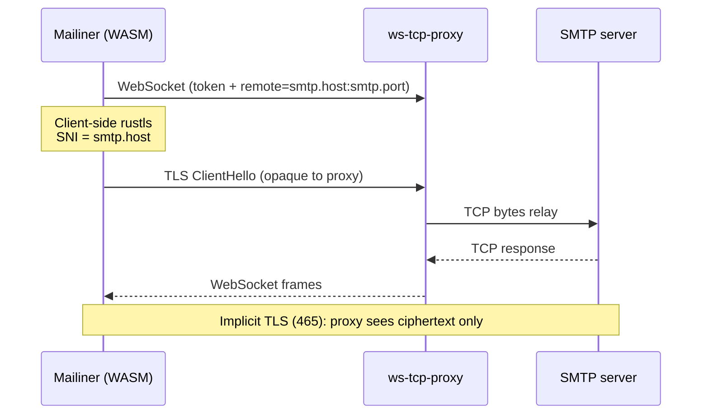
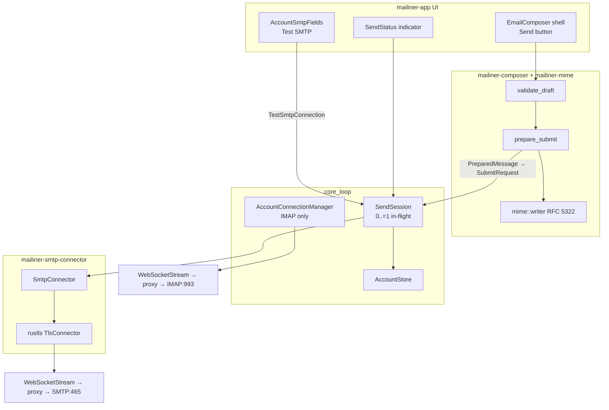
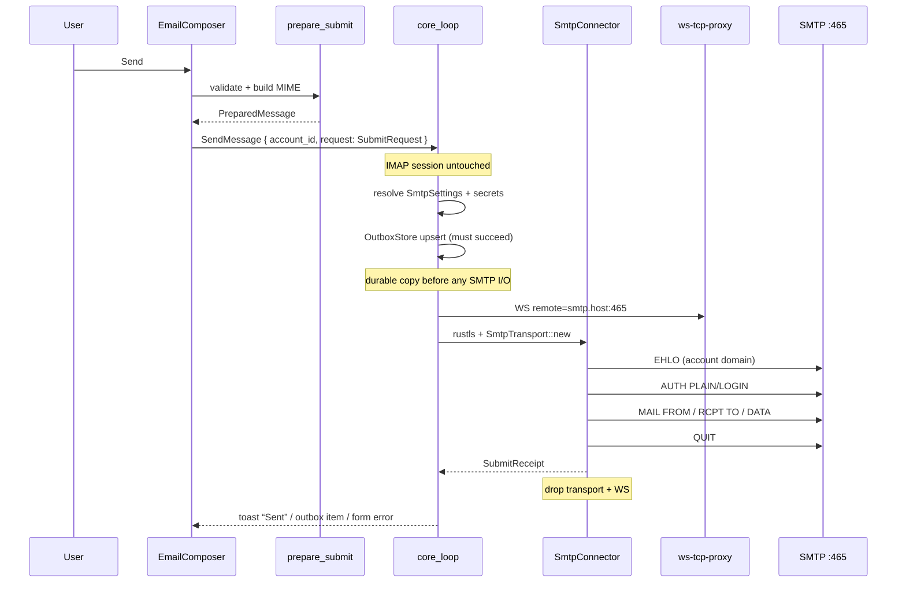
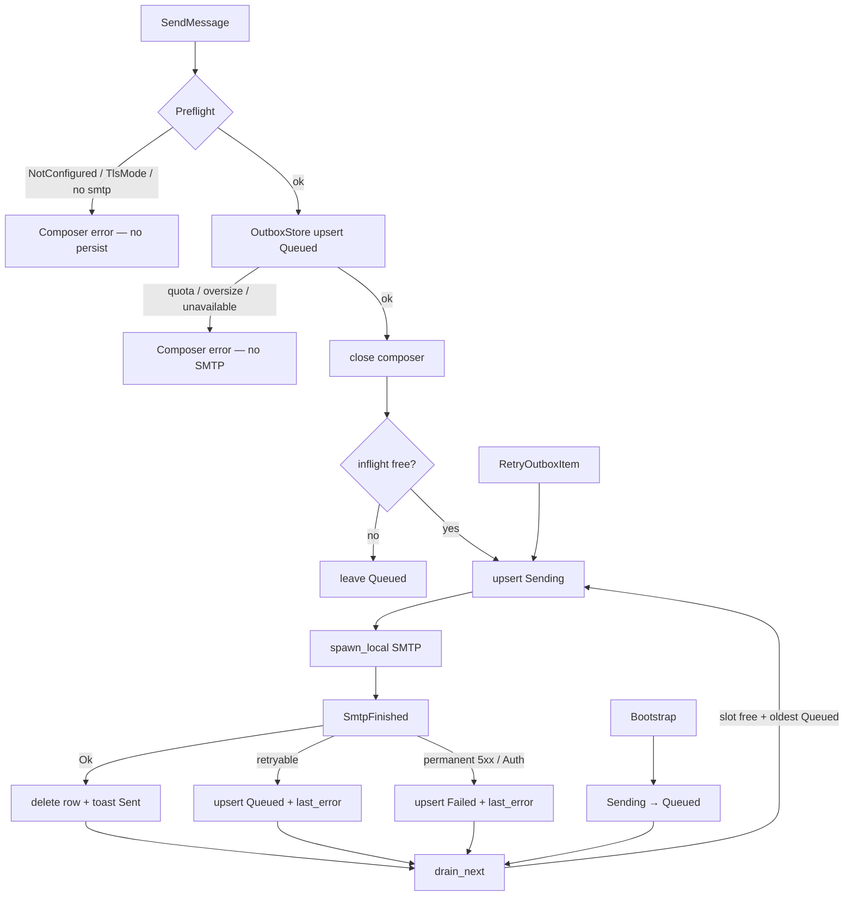
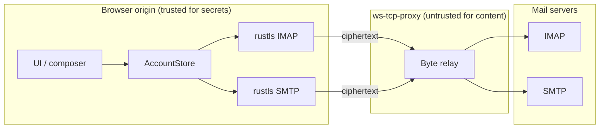

# SMTP Sending in Mailiner via async-smtp

| Field | Value |
|-------|-------|
| **Title** | SMTP Sending in Mailiner via async-smtp |
| **Author** | Mailiner design (agent) |
| **Date** | 2026-08-17 |
| **Status** | Draft (rev 5 — write-ahead outbox) |
| **Audience** | Senior engineers familiar with the Mailiner codebase |

---

## Overview

Mailiner is a browser-based IMAP client (Rust / Dioxus → WASM). Browsers cannot open raw TCP, so inbound mail already travels **browser WebSocket → `ws-tcp-proxy` → TCP**, with **client-side rustls** so the proxy only sees ciphertext. Outbound mail is not implemented: `SmtpSettings` is already persisted, the onboarding/settings forms collect optional SMTP fields, and the composer crate stops at a stub `export.rs`. There is **no** `crates/mailiner-app/src/send.rs` in the tree (the onboarding design mentioned a `StubTransport` there; that file was never added).

This design adds a short-lived SMTP submission path using **`async-smtp` 0.10.2** (`default-features = false`, `features = ["runtime-tokio"]`). Mailiner opens a **second** WebSocket to the existing proxy with `remote=smtp.host:smtp.port`, wraps it in rustls (implicit TLS, port 465), and hands a `BufReader<TlsStream<WebSocketStream>>` to `SmtpTransport::new`. MIME is built by `mailiner-composer` / `mailiner-mime`; the SMTP crate receives already-built RFC 5322 bytes plus an envelope. Sessions are one-shot: connect → EHLO → AUTH → MAIL/RCPT/DATA → QUIT. IMAP stays up; SMTP is dropped immediately after send.

Every accepted Send is **write-ahead persisted** in origin `localStorage` (`mailiner.outbox.v1`) **before** any SMTP I/O. A network error, tab close, browser crash, or leaving Mailiner must not drop the RFC 5322 bytes. SMTP starts only after that write returns success.

---

## Background & Motivation

### Current state (verified 2026-08-17)

| Location | Behavior |
|----------|----------|
| [`crates/mailiner-core/src/connector.rs`](crates/mailiner-core/src/connector.rs) | `EmailConnector<S>` is IMAP-shaped: `connect` / `disconnect` / `authenticate` / folders / envelopes / `BODY.PEEK`. **No send method.** `MockConnector` implements the same surface. |
| [`crates/mailiner-imap-connector/src/lib.rs`](crates/mailiner-imap-connector/src/lib.rs) | `ImapConnector::new(account_id, host, port, username)` — **password is not stored**; it is passed only to `authenticate`. `ensure_connected` builds rustls (`webpki_roots` + `TlsConnector`) over the caller-provided stream; `host` is SNI (`ServerName`). `port` is stored and unused for I/O. |
| [`crates/mailiner-app/src/websocket_stream.rs`](crates/mailiner-app/src/websocket_stream.rs) | Browser `WebSocket` as `tokio::io::{AsyncRead, AsyncWrite}`. `try_new`, `wait_until_open`, ready-state, Drop closes the socket. |
| [`crates/mailiner-app/src/connection.rs`](crates/mailiner-app/src/connection.rs) | `AccountConnectionManager` owns `HashMap<AccountId, ImapConnector<WebSocketStream>>`. Serial connect, `CONNECT_TIMEOUT_MS = 20_000`, generation counters, `classify_mailiner_error` / `classify_io_error` → `ConnectErrorKind::{NetworkOrProxy, TlsOrSni, Auth, Timeout, Cancelled, Internal}`. `test_connection` is ephemeral (never installed in the long-lived map). |
| [`crates/mailiner-app/src/core_event.rs`](crates/mailiner-app/src/core_event.rs) | `core_loop` **fully awaits each handler** before the next event. No send event. Soft-fail on every connector call. |
| [`crates/mailiner-app/src/account_config.rs`](crates/mailiner-app/src/account_config.rs) | `AccountConfig.smtp: Option<SmtpSettings>`. `SmtpSettings { host, port, username, password: Option<String>, use_tls: bool }`. Blank password → reuse IMAP at send time. `DEFAULT_SMTP_PORT = 465`. `ACCOUNT_STORE_SCHEMA_VERSION = 1`. `ProxySettings::websocket_url(&self, imap: &ImapSettings)` builds `remote=` from **IMAP** host/port (or `remote_host` / `remote_port` overrides). |
| [`crates/mailiner-app/src/components/account_form.rs`](crates/mailiner-app/src/components/account_form.rs) | `AccountSmtpFields` always shows: *“Sending is not implemented yet. These settings are saved for future use.”* |
| [`crates/mailiner-composer`](crates/mailiner-composer) | Intentionally transport-free ([`src/lib.rs`](crates/mailiner-composer/src/lib.rs)). `DraftDocument`, `validate_draft`, reply prefill, sanitize wrappers exist. **`export.rs` is a one-line stub** (`prepare_submit` in PR 7). `shell/email_composer.rs`, `recipient_field.rs`, `editor/{plain,rich,toolbar,mount,commands}.rs` are stubs. **`mailiner-app` does not depend on `mailiner-composer`.** |
| [`crates/mailiner-mime`](crates/mailiner-mime) | **Parse/decode only**: transfer-encoding decode, charset, BODYSTRUCTURE → parts. No RFC 5322 / multipart **writer**. |
| [`docs/design-onboarding-account-management.md`](docs/design-onboarding-account-management.md) | SMTP was **explicitly deferred** (PR8 saved settings only). Cited `send.rs` / `StubTransport` — **those files are not in the tree.** |
| README | Privacy model: client-side TLS; secrets in `localStorage` only; proxy is a byte relay. |

### Pain points

1. Users can compose nothing and send nothing — composer shell is unfinished and there is no SMTP transport.
2. Saved SMTP settings are dead: the UI promises “future use.”
3. `use_tls: bool` cannot express implicit TLS (465) vs STARTTLS (587) vs plaintext.
4. `ProxySettings::websocket_url` is IMAP-only. Reusing `remote_host` / `remote_port` for SMTP would send mail to the IMAP host.
5. `async-smtp` defaults `EHLO` to `127.0.0.1` (`ClientId::default`), which some providers reject.

### Connection topology (IMAP today; SMTP will mirror it)



IMAP and SMTP **cannot** share one TCP connection. A second WebSocket is required. The existing proxy protocol (`?token=&remote=`) does not change.

---

## Goals & Non-Goals

### Goals

1. Send a validated draft through the user’s SMTP server via `async-smtp` 0.10.2 over the existing proxy + client rustls.
2. Finish `prepare_submit` so the SMTP crate receives **envelope + RFC 5322 bytes**, not a lettre `Message`.
3. New `mailiner-smtp-connector` crate that mirrors `mailiner-imap-connector` (caller-owned stream, rustls inside the crate, password not stored).
4. Generalize proxy URL building so SMTP can pass `host:port` without overloading IMAP remote overrides.
5. Replace the underspecified `use_tls: bool` with an explicit `SmtpTlsMode`; load-map existing blobs **without** bumping `ACCOUNT_STORE_SCHEMA_VERSION`.
6. Wire composer Send → `core_loop` → SMTP, with progress, classified errors, and a clear path to settings when SMTP is missing.
7. Optional **Test SMTP** in onboarding/settings, parallel to IMAP `TestConnection`.
8. Keep WASM compile green; keep IMAP session alive during send; drop SMTP immediately after QUIT.
9. Preserve the privacy model: TLS in the browser; secrets never in `AppContext` signals or logs.
10. **Write-ahead outbox:** every accepted Send is in origin `localStorage` before SMTP I/O, so a crash, tab close, or network error cannot drop the message.

### Non-Goals (this design / v1 series)

- STARTTLS (port 587) and plaintext SMTP — **API + persistence in v1; protocol follow-up.**
- OAuth2 / XOAUTH2 (Mailiner has no OAuth; `async-smtp` has the mechanism but we will not call it).
- IMAP `APPEND` to Sent after a successful send — **explicit follow-up.**
- Warm / pooled SMTP connections.
- A custom SMTP protocol client (do not reimplement EHLO/AUTH/DATA).
- Lettre (or any crate that owns `TcpStream` / pulls `socket2`/`mio`).
- Changing `ws-tcp-proxy` protocol.
- DSN, PIPELINING as a required path. SMTPUTF8 is enabled **when the server advertises it**; headers still use RFC 2047 (K17).
- Building the entire composer editor (plain/rich/toolbar) in the SMTP PRs — those remain composer-crate work. S7 may ship a **plain-only** compose dialog (K18).
- Server-side accounts or **multi-account parallel SMTP**. v1 is **one in-flight SMTP operation globally**; a **write-ahead local outbox** (K23) is the durable queue behind that slot.
- Timer-based / exponential-backoff background daemon. Outbox drain is **event-driven** (Send, SmtpFinished, Retry, Bootstrap, Reconnect).
- **No SMTP-specific `remote_host` / `remote_port` in v1.** `smtp.host` is both rustls SNI and the proxy `remote=` dial name. Revisit if the same self-hosted-proxy users who needed IMAP overrides need the SNI ≠ TCP split for SMTP.

---

## Key Decisions

| # | Decision | Rationale |
|---|----------|-----------|
| K1 | Library: `async-smtp` 0.10.2, `default-features = false`, `features = ["runtime-tokio"]`. S4 pins `tokio` with workspace + `io-util` and adds a WASM `cargo check` in CI. | Sibling of the forked `async-imap`; caller-owned stream; `runtime-tokio` pulls tokio `time` + `io-util` only (no `net`/`socket2`). |
| K2 | New crate `mailiner-smtp-connector`, **not** an extra module on `mailiner-imap-connector` and **not** inlined in `mailiner-app`. | Mirrors `ImapConnector`. IMAP crate stays IMAP-only. App already treats `ImapConnector<WebSocketStream>` as a concrete type. |
| K3 | **Do not** add `send` to `EmailConnector`. **No** `MailSubmitter` trait in `mailiner-core` in v1. Production and tests use concrete `SmtpConnector`; `MockSubmitter` (if any) lives in `mailiner-smtp-connector`. | IMAP is a long-lived selected session. SMTP is a one-shot. A core trait waits until a second submitter exists. `SubmitRequest` / `SubmitReceipt` still live in core. |
| K4 | Implicit TLS (465) only in v1. Persist `SmtpTlsMode`; refuse StartTls/None at send/test with a settings path. | Matches `DEFAULT_SMTP_PORT = 465` and IMAP’s implicit-TLS-only v1. STARTTLS would expose EHLO/STARTTLS plaintext to the proxy. |
| K5 | `ProxySettings.remote_host` / `remote_port` remain **IMAP-only**. SMTP uses `smtp.host` for **both** `remote=` and rustls SNI. No SMTP override pair in v1. | Reusing IMAP overrides would silently submit to the IMAP host. The IMAP SNI ≠ dial-name split is deliberately omitted for SMTP until the same proxy users need it. |
| K6 | Short-lived SMTP: connect → EHLO → AUTH → MAIL/RCPT/DATA → QUIT → drop. Never store an `SmtpTransport` beside IMAP. | WASM memory. SMTP is not selected-state. |
| K7 | **One in-flight SMTP operation globally** (send or test). `spawn_local` the I/O; the spawned task **only** `unbounded_send`s `CoreEvent::SmtpFinished` (and optional `SmtpProgress`) back to `core_loop`. `core_loop` is the **sole writer** of `inflight` / generation / `send_status`. Cancel via a oneshot/watch the spawned task `select`s against; fire it on delete/disconnect of that account. | `spawn_local` returns `()` and cannot assign `inflight = None`. Posting back onto `core_rx` is the only way the serial loop sees completion. Dropping a token in `core_loop` does nothing unless the future selects on it. |
| K8 | IMAP APPEND to Sent is **out of v1**. | Needs `\Sent` discovery, IMAP session lock, and a second copy of the RFC 822. Follow-up PR. |
| K9 | MIME writer lives in `mailiner-mime` (owns CRLF, folding, multipart `Content-Type`, RFC 2047). `prepare_submit` in `mailiner-composer` (depends on `mailiner-mime` in S2). SMTP never builds headers. | `mailiner-mime` is decode-only today. Composer stays transport-free. |
| K10 | SMTP remains **optional** on `AccountConfig`. Missing SMTP at send time is a hard, user-facing error with a link to settings. | Do not guess `smtp.{domain}` or silently reuse IMAP host. |
| K11 | Username: SMTP username if non-empty, else IMAP username, else account email. Password: `smtp.password` if `Some` and non-empty, else IMAP password. | Matches the existing form copy (“Leave empty to reuse IMAP password”) and typical provider setups. |
| K12 | EHLO identity = domain of `AccountConfig.email`, else `smtp.host`. Never `127.0.0.1`. **Message-ID** domain = domain of `FromIdentity.email` (fallback `mailiner.invalid`). | `ClientId::default()` is `127.0.0.1`; some relays reject it. Composer has no `smtp.host`. |
| K13 | **Do not bump** `ACCOUNT_STORE_SCHEMA_VERSION` in this series. S3 adds `tls_mode` via **custom deserialize / intermediate struct**; **do not rely on `#[serde(default)]` for `tls_mode`**. Keep writing `use_tls`, always **derived from `tls_mode`**. Schema 2 is a later one-way door. | `#[serde(default)]` turns a missing key into `Implicit` and loses 587 → `StartTls`. Key presence must be detected. A v2 stamp orphans any tab still on the old WASM. |
| K14 | AUTH: **PLAIN if advertised, else LOGIN if advertised, else Auth**. Never retry LOGIN on **535**. Do not trust `try_login` `Ok(())` when neither mechanism was advertised. No XOAUTH2. | 535 is bad password, not “try another SASL.” `try_login` returns `Ok(())` when the server advertised nothing. |
| K15 | Do not implement a custom SMTP client. | Settled. |
| K16 | v1 `use_tls=true` + port **587** maps to `SmtpTlsMode::StartTls` (not Implicit). S6 shows a **blocking inline warning** that STARTTLS cannot send/test yet; user must switch to implicit TLS / 465. | Do not silently mis-send implicit TLS to a 587 server. Existing form already allows 587 + TLS. |
| K17 | `smtp_utf8(true)`: emit the SMTPUTF8 parameter **only if the server advertised it**. Headers still RFC 2047 in v1. | Safe deliverability; no UTF-8 header experiment. |
| K18 | S7 acceptance: a user can send a **plain-text** message (To + Subject) from the main UI against implicit TLS 465. Rich editor may still be stubbed. | Unblocks SMTP dogfood without waiting on the full shell. |
| K19 | `SubmitRequest` carries `message_id`. `CoreEvent::SendMessage` carries `mailiner_core::SubmitRequest` (not `PreparedMessage`). App maps at the S7 shell boundary. | S5 can send fixture bytes before composer exists. One DTO across core/app/connector. |
| K20 | Test SMTP outcomes go to **`smtp_test_status`**, not `send_status` and not `connection_states`. | `SendErrorKind` must not be flattened into IMAP `ConnectErrorKind`. Composer send and form Test must not share one `Option`. |
| K21 | Omit `User-Agent` in v1. | Reduces a new outbound fingerprint. EHLO override stays (required). |
| K22 | Success toast is exactly **“Sent”**. Do not mention Sent-folder / APPEND. | User decision. S9 remains a follow-up; the toast stays short. |
| K23 | **Write-ahead outbox in v1.** After preflight, `OutboxStore::upsert` must succeed **before** `spawn_local` / WS open. Never start SMTP without a durable copy. Survive reload, crash, and leaving the origin. Separate `mailiner.outbox.v1` key (account schema stays 1). No passwords. One global in-flight drain. Preflight `NotConfigured` / `TlsModeUnsupported` still fail in the composer (draft never left). | User requirement: network error / crash / leaving Mailiner must not lose accepted mail. Persist-on-failure is not crash-safe. |

---

## Proposed Design

### High-level architecture



`AccountConnectionManager` stays IMAP-only. A sibling **send session** (not a warm pool) is owned by `core_loop`: at most **one** `spawn_local` SMTP future at a time. Completion and cancel are mediated by `CoreEvent::SmtpFinished` and a oneshot/watch (see § Concurrency). `core_loop` is the sole writer of `inflight`.

### Crate split

| Crate | Role |
|-------|------|
| **`mailiner-smtp-connector`** (new) | `SmtpConnector`, rustls, `async-smtp` session, error mapping. Depends on `mailiner-core`, `async-smtp`, `tokio-rustls` / `rustls` / `webpki-roots` (same versions as IMAP). |
| **`mailiner-core`** | `SubmitRequest` / `SubmitReceipt` only. **No** `send` on `EmailConnector`. **No** `MailSubmitter` trait in v1. |
| **`mailiner-mime`** | New `writer` module: CRLF, folding, RFC 2047, CTE encode (base64 / QP), multipart serializer (owns `Content-Type`). |
| **`mailiner-composer`** | Implement `export::prepare_submit`. Depends on `mailiner-mime` (S2). Still no IMAP/SMTP. |
| **`mailiner-app`** | URL builder, TLS-mode load/save, send/test events, `OutboxStore` (`mailiner.outbox.v1`), `send_status` + `smtp_test_status` + `outbox`. Depend on `mailiner-smtp-connector` in S5; **`mailiner-composer` only in S7**. |

**Rejected splits:**

- Putting SMTP inside `mailiner-imap-connector` would mix session-oriented IMAP with one-shot SMTP, pull `async-smtp` into every IMAP build, and invert the crate name.
- Putting SMTP only in `mailiner-app` would bury rustls + AUTH next to Dioxus UI and make host-side unit tests of envelope/auth mapping harder.

TLS setup is ~15 lines (copy of `ImapConnector::ensure_connected`). **Duplicate it in `SmtpConnector` for v1** with a comment pointing at the IMAP copy. Extracting a `mailiner-tls` crate is a follow-up if a third caller appears. Do **not** put rustls in `mailiner-core`.

### How send is invoked

Composer and app today have no compose overlay and no send event. The contract:

1. App maps the selected UI account → `FromIdentity { display_name, email }` (same mapping the onboarding design called `identity_from_ctx`; it is not in the tree yet).
2. Composer shell holds a `DraftDocument`. Send runs `validate_draft` then `prepare_submit` **in the UI/app layer** (sync, no secrets).
3. Shell maps `PreparedMessage` → `SubmitRequest` + `OutboxDisplay` (subject + To preview) and sends `CoreEvent::SendMessage { account_id, request, display }`. **No password on the channel.** S5 can inject a hand-built `SubmitRequest` before S7 exists.
4. `core_loop` loads `AccountConfig` via `manager.resolve_config` / `store.get` (the only secret-bearing path). Pre-flight `NotConfigured` / `TlsModeUnsupported` fail immediately (no outbox; draft stays in the composer). Otherwise **write-ahead:** `OutboxStore::upsert` (`Queued`, then `Sending` if the slot is free). If the upsert fails (quota / oversize / unavailable), **do not** open a WebSocket; keep the draft open. Only after a successful write: close the composer (“Sending…” / “Queued”) and `spawn_local` if `inflight` is free. The spawned task **does not** mutate `inflight` or `send_status`; it `unbounded_send`s `SmtpProgress` / `SmtpFinished` back onto `core_rx`.
5. On success: delete the outbox row, toast **“Sent”** (K22). On **retryable** failure: keep the row `Queued` + `last_error`. On **permanent** failure: mark the row `Failed` (bytes stay on disk; Retry/Delete). Never rely on the composer still being open.



`TestSmtpConnection` is ephemeral (`request_id`, connect + EHLO + AUTH + QUIT, **no** MAIL/DATA, never persist, never install a long-lived connector) but **does not** reuse IMAP `connection_states` or composer `send_status`. Outcomes go to `smtp_test_status: Signal<HashMap<AccountId, SendState>>` (K20).

### MIME export (`prepare_submit`)

[`crates/mailiner-composer/src/export.rs`](crates/mailiner-composer/src/export.rs) is currently:

```rust
//! Draft → MIME export orchestration (`prepare_submit` in PR 7).
```

[`validate_draft`](crates/mailiner-composer/src/model/draft.rs) already enforces: From present, To non-empty, v1 email syntax, no pending attachments/inlines, caps (`MAX_FILE_BYTES` 25 MiB, `MAX_DRAFT_BYTES` 40 MiB, 20 attachments, 30 inlines, 1.5 MiB HTML/plain). Empty subject is allowed.

#### Public API (composer)

```rust
// crates/mailiner-composer/src/export.rs

/// SMTP envelope (RFC 5321 MAIL FROM / RCPT TO). Distinct from header From/To/Cc/Bcc.
#[derive(Debug, Clone, PartialEq, Eq)]
pub struct SubmitEnvelope {
    pub mail_from: String,
    pub rcpt_to: Vec<String>,
}

#[derive(Debug, Clone)]
pub struct PreparedMessage {
    pub envelope: SubmitEnvelope,
    /// Complete RFC 5322 message including headers. Not wrapped in SMTP DATA dot-stuffing
    /// — `async-smtp` handles the wire framing.
    pub rfc822: Vec<u8>,
    /// Generated Message-ID without surrounding display; also written into headers.
    pub message_id: String,
}

#[derive(Debug, thiserror::Error)]
pub enum PrepareSubmitError {
    #[error("draft validation failed")]
    Validation(Vec<DraftValidationError>),
    #[error("MIME serialization failed: {0}")]
    Serialize(String),
}

pub fn prepare_submit(
    draft: &DraftDocument,
    identity: &FromIdentity,
) -> Result<PreparedMessage, PrepareSubmitError>;
```

Composer remains free of `async-smtp` types. S7 maps `PreparedMessage` → `SubmitRequest` (`mail_from`, `rcpt_to`, `rfc822`, `message_id`). The SMTP crate accepts `&str` addresses and builds `async_smtp::Envelope`. S2 adds `mailiner-mime` to [`mailiner-composer/Cargo.toml`](crates/mailiner-composer/Cargo.toml) (today: core + html only).

#### Envelope construction

| SMTP field | Source |
|------------|--------|
| `MAIL FROM` | `draft.from.email` if valid, else `identity.email` |
| `RCPT TO` | unique addresses from `to` ∪ `cc` ∪ `bcc` (order: To, Cc, Bcc), after `dedupe_addresses` |

Bcc addresses are **recipients** but the `Bcc:` header is **omitted** from `rfc822` (standard submission). The sender’s Sent-folder copy (follow-up) may re-insert Bcc. This **supersedes** the [`DraftDocument.bcc`](crates/mailiner-composer/src/model/draft.rs) comment that Bcc is “included in v1 .eml export.” Snapshot tests must assert Bcc on the envelope and **absent** from headers.

#### Header set (v1)

| Header | Rule |
|--------|------|
| `From` | `Name <email>` from draft/identity; encode display name with RFC 2047 if non-ASCII |
| `To` / `Cc` | Same; omit empty lists |
| `Subject` | May be empty; RFC 2047 if non-ASCII |
| `Date` | `Utc::now()` RFC 5322 |
| `Message-ID` | `<{uuid}@{domain-of-identity.email}>`. Domain = substring after `@`, lowercased, non-empty, contains `.`, not `localhost` / `127.0.0.1`; else `mailiner.invalid`. Composer does **not** call `ehlo_domain` (no `smtp.host`). |
| `MIME-Version` | `1.0` — writer emits if the caller omitted it |
| `In-Reply-To` / `References` | If `draft.in_reply_to` / `draft.references` set (normalize angle brackets) |
| `User-Agent` | **Omitted in v1** (K21). |

#### Body tree

```
if attachments nonempty:
  multipart/mixed
    └── [body tree]
    └── each FileAttachment (Content-Disposition: attachment)
else:
  [body tree]

body tree:
  if inline_images nonempty:
    multipart/related
      └── alternative-or-single
      └── each InlineImage (Content-ID: <content_id>, disposition inline)
  else:
    alternative-or-single

alternative-or-single:
  if mode == Rich (or html_body nonempty):
    multipart/alternative
      ├── text/plain  (plain_body, or html_to_plain if plain_cache_dirty)
      └── text/html   (sanitize_for_export(html_body); cid: URLs left intact)
  else:
    text/plain
```

Transfer encodings:

| Part | CTE | Notes |
|------|-----|-------|
| `text/plain`, `text/html` | quoted-printable | UTF-8 charset. Reuse a new `mailiner_mime::codec::qp_encode`. |
| attachments / inlines | base64 | New `base64_encode` (76-col wrap). `mailiner-mime` currently only **decodes**. |

Do **not** use lettre’s builder. Do **not** pull `mail-builder` / `email-encoding` unless WASM + license review passes later; v1 is small enough to own.

#### Wire-format contract (implementable)

| Rule | Owner |
|------|--------|
| **Always CRLF** (`\r\n`). Never emit bare `\n`. WASM/Rust strings are `\n`; the writer converts. | Writer |
| Header folding: 78-octet lines (RFC 5322 §2.2.3); RFC 2047 encoded-words split rather than exceeding the limit. | Writer |
| RFC 2047 / mailbox encoding. Composer passes **raw Unicode** header values (`From`, `To`, `Subject`, …). The writer is the **only** RFC 2047 encoder. | Writer |
| Multipart `Content-Type: multipart/{subtype}; boundary="…"` (and `MIME-Version` on the message root if missing). Callers must **not** also put `Content-Type` on a `MimeBody::Multipart` part. | Writer |
| Attachment filenames: ASCII `filename="…"`; when non-ASCII, also RFC 2231 `filename*=UTF-8''…`. | Writer (`format_disposition`) |
| Body octets already CTE-encoded by the caller (QP / base64 helpers in `mailiner-mime::codec`). | Composer + codec |

Snapshot tests (S1/S2) **must** include `\r\n` byte checks, a folded long Subject, a non-ASCII filename, and Bcc-in-envelope / Bcc-not-in-headers.

#### `mailiner-mime` writer (new)

```rust
// crates/mailiner-mime/src/writer/mod.rs  (new)

pub struct MimePart {
    /// Raw Unicode field values (except Content-Type on multiparts — writer synthesizes that).
    pub headers: Vec<(String, String)>,
    pub body: MimeBody,
}

pub enum MimeBody {
    Octets(Vec<u8>),           // already CTE-encoded
    Multipart { subtype: String, boundary: String, parts: Vec<MimePart> },
}

pub fn serialize_message(headers: &[(String, String)], root: &MimePart) -> Result<Vec<u8>, WriteError>;
pub fn generate_boundary() -> String; // "=_mlnr_" + 24 hex
pub fn encode_unstructured(s: &str) -> String; // RFC 2047 when needed
pub fn format_mailbox(name: Option<&str>, email: &str) -> String;
pub fn format_disposition(kind: &str, filename: Option<&str>) -> String; // filename= + filename*
```

Keep the writer allocation-honest: one output `Vec<u8>`. Peak extra memory ≈ encoded size (base64 ≈ 4/3). Combined with a 40 MiB draft cap, worst-case RFC 822 is ~55 MiB — acceptable for v1, called out under Risks.

### `EmailConnector` vs `MailSubmitter`

`EmailConnector` ([`connector.rs`](crates/mailiner-core/src/connector.rs)) is a **session** trait: `connect(stream)`, then many folder/message calls, then `disconnect`. SMTP has no SELECT, no UID, no long-lived authenticated session we want to keep.

Adding `send` to `EmailConnector` would:

- Force `ImapConnector` and `MockConnector` to grow a method that cannot work on an IMAP stream.
- Imply SMTP shares the IMAP `S` and mutex (`Arc<Mutex<ImapSession<S>>>`).
- Collapse two lifecycles into one trait the app already uses as a **concrete** `ImapConnector<WebSocketStream>` (not a trait object).

**v1:** do not change `EmailConnector`. Do **not** add a `MailSubmitter` trait to `mailiner-core` until a second production submitter exists. `core_loop` calls concrete `SmtpConnector` (same style as today’s concrete `ImapConnector<WebSocketStream>`). A scripted mock stream in `mailiner-smtp-connector` tests is enough; if a `MockSubmitter` is useful for app tests, keep it in that crate, not core.

Core still owns the DTOs so S5 does not depend on composer:

```rust
// crates/mailiner-core/src/submit.rs  (new)

#[derive(Debug, Clone)]
pub struct SubmitRequest {
    pub mail_from: String,
    pub rcpt_to: Vec<String>,
    pub rfc822: Vec<u8>,
    /// Copied into `SubmitReceipt` and already written into `rfc822` headers.
    pub message_id: String,
}

#[derive(Debug, Clone)]
pub struct SubmitReceipt {
    pub message_id: String,
    /// SMTP reply text, truncated, no secrets.
    pub server_reply: Option<String>,
}
```

`S` bounds on `SmtpConnector::{submit, test}` match what the methods actually need: `AsyncRead + AsyncWrite + Unpin + Debug + Send`. They do **not** require `Sync`. WASM is single-threaded; `WebSocketStream` must not hop threads (`SendWrapper`).

### Transport & TLS

#### Generalize `websocket_url`

Today ([`account_config.rs`](crates/mailiner-app/src/account_config.rs) `ProxySettings::websocket_url`):

```rust
pub fn websocket_url(&self, imap: &ImapSettings) -> Result<String, AccountConfigError> {
    let remote_host = self.remote_host.as_deref().unwrap_or(imap.host.as_str()).trim();
    let remote_port = self.remote_port.unwrap_or(imap.port);
    // … encode token + remote=host:port
}
```

`remote_host` / `remote_port` are documented as IMAP overrides. **They must not apply to SMTP.**

Refactor:

```rust
impl ProxySettings {
    /// Existing IMAP entry point — keeps override semantics.
    pub fn websocket_url(&self, imap: &ImapSettings) -> Result<String, AccountConfigError> {
        let host = self.remote_host.as_deref().unwrap_or(imap.host.as_str());
        let port = self.remote_port.unwrap_or(imap.port);
        self.websocket_url_for(host, port)
    }

    /// SMTP / any explicit remote. Does **not** consult remote_host/remote_port.
    /// v1 SMTP: host is smtp.host (also rustls SNI). No SMTP remote override pair.
    pub fn websocket_url_for(&self, host: &str, port: u16) -> Result<String, AccountConfigError> {
        // same validation as today: empty host, scheme ws/wss, no fragment,
        // percent-encode token + host, `&` if query already present
    }
}
```

`AccountConfig::validate` continues to build the **IMAP** URL (required). If `smtp` is `Some`, also require `smtp.host` non-empty (already done) and that `websocket_url_for(&smtp.host, smtp.port)` succeeds.

#### Implicit TLS (v1 default)

Match IMAP:

```
WebSocketStream::try_new(url)
  → wait_until_open
  → rustls TlsConnector (webpki_roots, SNI = smtp.host)
  → BufReader::new(tls_stream)   // SmtpTransport needs AsyncBufRead
  → SmtpClient::new()
        .hello_name(ClientId::new(ehlo_domain))
        .smtp_utf8(true)         // K17: parameter only if server advertised SMTPUTF8
        .pipelining(false)       // v1: keep the dialogue simple
  → SmtpTransport::new(client, buf).await   // reads 220 greeting + EHLO
  → auth
  → send / or just quit (test)
  → quit
  → drop
```

`SmtpTransport<S>` requires `S: tokio::io::AsyncBufRead + AsyncWrite + Unpin`. IMAP’s `Client<TlsStream<S>>` only needs `AsyncRead + AsyncWrite`. The extra `BufReader` is SMTP-specific.

#### STARTTLS (587) — follow-up, designed now

`async-smtp` 0.10.2 `starttls(self) -> Result<S, Error>` returns the **same** `S` that was passed in. If that `S` is `BufReader<WebSocketStream>`, rustls must wrap the **inner** stream, not the `BufReader` (double-buffering / wrong type).

```text
plain: BufReader<WebSocketStream>
  → SmtpTransport::new(client, plain)     // 220 + EHLO on cleartext
  → starttls().await                      // issues STARTTLS; returns BufReader<WebSocketStream>
  → into_inner()                          // tokio BufReader → WebSocketStream
  → rustls TlsConnector (SNI = smtp.host)
  → BufReader::new(tls_stream)
  → SmtpClient::without_greeting().hello_name(...)
  → SmtpTransport::new(client2, tls_buf)  // no second greeting
  → AUTH only after this second new()
```

**v1 does not run this path.** Reasons:

1. Between TCP connect and STARTTLS the **proxy sees plaintext** EHLO/STARTTLS (and the server greeting). Implicit TLS avoids that window and matches Mailiner’s “proxy sees ciphertext only” claim.
2. IMAP v1 is already implicit-TLS-only (`ImapSettings.use_tls` is reserved / default true).
3. Implementation is a second state machine (greeting consumed, wrap, `without_greeting`).

Persisted `SmtpTlsMode::StartTls` is valid; send/test return `SendErrorKind::TlsModeUnsupported` with copy: *“STARTTLS (port 587) is not supported yet. Use implicit TLS on port 465, or wait for a later release.”*

Plaintext (`None`) is persisted but never used for send.

#### `use_tls` → `SmtpTlsMode`

```rust
#[derive(Debug, Clone, Copy, Serialize, Deserialize, PartialEq, Eq, Default)]
#[serde(rename_all = "snake_case")]
pub enum SmtpTlsMode {
    #[default]
    Implicit,
    StartTls,
    None,
}

pub struct SmtpSettings {
    pub host: String,
    pub port: u16,
    pub username: String,
    pub password: Option<String>,
    pub tls_mode: SmtpTlsMode,
    /// Dual-written for old WASM (schema stays 1). **Always derived from `tls_mode`**
    /// on save (`Implicit | StartTls` → `true`, `None` → `false`). Never an independent source of truth after a `tls_mode` key is present.
    pub use_tls: bool,
}
```

Do **not** use `tls_mode_was_absent()` after `#[serde(default)]` — a missing key becomes `Implicit` and the 587 case is lost. Custom deserialize (or `#[serde(from)]` via an intermediate):

```text
if JSON has "tls_mode" → trust tls_mode; set use_tls = tls_mode != None
else                   → tls_mode = map(use_tls.unwrap_or(true), port)
                         use_tls   = tls_mode != None   // re-derive so they cannot diverge
```

**Mapping when `tls_mode` is absent** (literal v1 JSON):

| `use_tls` | `port` | Resulting `tls_mode` |
|-----------|--------|----------------------|
| `true` (or missing) | `587` | `StartTls` |
| `true` (or missing) | other (incl. 465) | `Implicit` |
| `false` | any | `None` |

Required unit test: a literal v1 object `{ "use_tls": true, "port": 587, … }` (no `tls_mode` key) deserializes as `StartTls`, and re-serializing writes **both** `"tls_mode": "start_tls"` and `"use_tls": true`.

`ACCOUNT_STORE_SCHEMA_VERSION` stays **1**. Schema 2 is a later one-way door (drops `use_tls` on write and/or stamps v2). Dual-write does **not** protect old tabs once the version is 2.

v1 **send/test** only accept `Implicit`. Other modes fail closed with `TlsModeUnsupported` **and** S6 shows a blocking inline warning when the loaded/selected mode is `StartTls` or `None` (K16) — not only after the user clicks Test.

**S3 vs S6 UI:** S3 can keep the “Use TLS” checkbox: `optional_smtp_from_fields` maps `use_tls` + port as above (so 587 + checked already persists `StartTls`). S6 replaces the checkbox with a `<select>`:

- Implicit TLS (recommended, port 465)
- STARTTLS (port 587) — selectable so users can save settings; Test/Send refuse with the inline warning
- None — selectable; Test/Send refuse

**Port auto-update:** rewrite port **only** when it still equals the previous mode’s default (Implicit ↔ 465, StartTls ↔ 587). A user-typed `2525` is left alone when the mode changes.

**`optional_smtp_from_fields` emptiness** (S3 rewrite; tests parallel to today’s `optional_smtp_empty_section_is_none` / `optional_smtp_partial_requires_host`):

```text
section_empty =
    host.is_empty()
    && username.is_empty()
    && password_empty
    && (port empty or port == default_for(tls_mode))
    && tls_mode == Implicit
```

Leftover port `587` or `tls_mode != Implicit` means the section is **in use** (same spirit as today’s `use_tls == false` / port 587). Blank port defaults: Implicit → 465, StartTls → 587, None → leave/require an explicit port (or 25; v1 send will refuse `None` anyway).

### Auth

`async-smtp` 0.10.2: `Mechanism::{Plain, Login, Xoauth2}`, `Credentials`, `SmtpTransport::auth`.

```rust
fn smtp_username(config: &AccountConfig, smtp: &SmtpSettings) -> &str {
    let u = smtp.username.trim();
    if !u.is_empty() {
        return u;
    }
    let imap_u = config.imap.username.trim();
    if !imap_u.is_empty() {
        return imap_u;
    }
    config.email.trim()
}

fn smtp_password<'a>(config: &'a AccountConfig, smtp: &'a SmtpSettings) -> &'a str {
    match smtp.password.as_deref() {
        Some(p) if !p.is_empty() => p,
        _ => config.imap.password.as_str(),
    }
}
```

Mechanism selection — **one public-API path** (do not fork async-smtp for a `server_info()` getter; that is out of v1):

`async-smtp` 0.10.2 `SmtpTransport::new` already consumes the 220 greeting + first EHLO into a **private** `server_info`. `try_login` returns `Ok(())` when nothing advertised — **never call it**. There is no public getter.

After `SmtpTransport::new`:

1. `get_mut()` → `&mut SmtpStream`. Issue a **second** `EHLO` with the same `hello_name` (`ClientId::new(...)`).
2. Parse the 250 response the same way `async_smtp::extension::ServerInfo::from_response` does (public). Read the `AUTH` list from that `ServerInfo`.
3. If `PLAIN` is advertised → `auth(Mechanism::Plain, &credentials)` only.
4. Else if `LOGIN` is advertised → `auth(Mechanism::Login, &credentials)` only.
5. Else → `SendErrorKind::Auth` (“server did not advertise PLAIN or LOGIN”). **Do not** call `auth` / `try_login`.
6. **Never** retry LOGIN after a **535** (bad password, not “wrong mechanism”). Do not scrape 535 text.
7. 504 / 534 / 502 on AUTH when we thought the mechanism was advertised → fail as Auth (do not fall through to the other mechanism).
8. `MAIL` / later `530` (must authenticate) → `SendErrorKind::Auth`.

S4 keeps the duplex fixture with **no AUTH** line; `test`/`submit` must return Auth. Do not send XOAUTH2. Do not log credentials. `SmtpConnector` stores host, port, username, hello-name — **not** the password (same contract as `ImapConnector::new`).

### EHLO identity

`ClientId::default()` is `Ipv4(127.0.0.1)` ([async-smtp `extension.rs`](https://docs.rs/async-smtp/0.10.2/src/async_smtp/extension.rs.html#23-34)). Always override:

```rust
pub fn ehlo_domain(email: &str, smtp_host: &str) -> String {
    email
        .rsplit_once('@')
        .map(|(_, d)| d.trim())
        .filter(|d| !d.is_empty() && d.contains('.') && !d.eq_ignore_ascii_case("localhost"))
        .map(|d| d.to_ascii_lowercase())
        .filter(|d| d != "127.0.0.1")
        .unwrap_or_else(|| {
            let h = smtp_host.trim().trim_matches('.').to_ascii_lowercase();
            if h.is_empty() { "mailiner.invalid".into() } else { h }
        })
}
```

Use `ClientId::new(ehlo_domain)`. Never advertise a loopback EHLO.

### Connection lifecycle

#### Timeouts

| Phase | Budget | Constant |
|-------|--------|----------|
| WS open + rustls + 220 + EHLO + AUTH | 20 s | reuse `CONNECT_TIMEOUT_MS` |
| MAIL / RCPT / DATA / QUIT | 90 s | new `SMTP_DATA_TIMEOUT_MS = 90_000` |
| Test SMTP (no DATA) | 20 s | `CONNECT_TIMEOUT_MS` |

Race with `gloo_timers::future::TimeoutFuture` + `futures_util::future::select`, same as [`connect_account`](crates/mailiner-app/src/connection.rs). On timeout, drop the future (Drop closes `WebSocketStream`).

Do **not** use `async-smtp`’s `Error::Timeout(Elapsed)` as the primary timer. Enabling tokio `time` on WASM does not give a browser-driven timer; IMAP already races `gloo_timers::future::TimeoutFuture` in `connect_account`. S4 still enables tokio `io-util` for `BufReader`.

#### Error classification

Parallel to `ConnectErrorKind`, plus SMTP-specific:

```rust
#[derive(Debug, Clone, Copy, PartialEq, Eq)]
pub enum SendErrorKind {
    NetworkOrProxy,
    TlsOrSni,
    Auth,
    Timeout,
    Cancelled,
    Internal,
    /// `smtp` is None or host empty.
    NotConfigured,
    /// Persisted StartTls / None in v1.
    TlsModeUnsupported,
    /// 5xx on RCPT (one or more recipients).
    RecipientRejected,
    /// 5xx 552 / message size.
    MessageTooLarge,
    /// Other 5xx on MAIL/DATA.
    Permanent,
    /// 4xx — user may retry.
    Transient,
}

pub struct SendError {
    pub kind: SendErrorKind,
    pub message: String, // user-safe, no secrets
    pub retryable: bool,
    pub smtp_code: Option<u16>,
}
```

Map `async_smtp::error::Error`:

| `async_smtp::Error` | Kind | retryable |
|---------------------|------|-----------|
| `Transient(Response)` | `Transient` (or `RecipientRejected` if 450/452 on RCPT) | true |
| `Permanent(Response)` 535/534 AUTH | `Auth` | true |
| `Permanent` 550/551/553 RCPT | `RecipientRejected` | false |
| `Permanent` 552 | `MessageTooLarge` | false |
| other `Permanent` | `Permanent` | false |
| `Io` / `Resolution` | `NetworkOrProxy` or `TlsOrSni` via existing string heuristics | true |
| `Timeout` | `Timeout` | true |

`NotConfigured` / `TlsModeUnsupported` are produced **before** opening a socket.

#### Concurrency

Today `core_loop` documents: *each handler is fully awaited before the next event*. A 40 MiB DATA on a slow uplink would freeze FETCH/SELECT if send were just another match arm. A `select(core_rx, inflight.fut)` is **not** enough either: while `handle_fetch_message_range` is awaited, the send future is not polled.

**v1 rule:** at most **one** in-flight SMTP operation **globally** (send **or** Test SMTP). Not one-per-account. A second `SendMessage` / `TestSmtpConnection` is rejected with “A send is already in progress.” IMAP handlers stay fully serial.

`spawn_local` returns `()` — there is **no** join handle to drop, and the spawned task **cannot** assign `core_loop`’s `inflight`. The tree has **no** `wasm_bindgen_futures` usage today; S5 adds it (or Dioxus `spawn`) as an explicit dependency. Cooperative, not a thread. `WebSocketStream` / `SendWrapper` never hop threads.

`core_loop` must take a clone of the `UnboundedSender<CoreEvent>` (today it only has the receiver). The spawned task’s **only** communication with the loop is `unbounded_send`:

```rust
// additions — same CoreEvent channel, no side channel
CoreEvent::SmtpProgress { generation: u64, phase: SendPhase }, // Transmitting
CoreEvent::SmtpFinished { generation: u64, outcome: SmtpOutcome },
// SmtpOutcome::Send(Result<SubmitReceipt, SendError>)
// SmtpOutcome::Test { request_id, result: Result<(), SendError> }
```

```text
struct InFlightSmtp {
    account_id: AccountId,
    generation: u64,
    cancel_tx: futures::channel::oneshot::Sender<()>, // or watch::Sender
    outbox_id: Option<OutboxId>, // Some on Send (row already written); None on Test
}

// spawned task (owns WebSocketStream + SmtpTransport):
select(
    run_smtp(...),                    // TLS + AUTH + DATA
    cancel_rx,                        // oneshot/watch
    TimeoutFuture(CONNECT / DATA),
)
on any arm finishing: drop transport/WS (Drop → shutdown_socket)
unbounded_send(SmtpFinished { generation, outcome })
// after AUTH (send only): unbounded_send(SmtpProgress { generation, Transmitting })

on TestSmtpConnection:
    if inflight.is_some() → reject (“A send is already in progress.”)
    else spawn as below (never write the outbox)

on SendMessage:
    if preflight NotConfigured | TlsModeUnsupported → Failed, no persist
    else:
        upsert Queued  // MUST succeed; else Failed in composer, no WS
        close composer
        if inflight.is_none() { mark Sending; spawn }
        // if inflight occupied: leave Queued; drain_next later

on spawn (live Send or drain):
    bump generation
    let (cancel_tx, cancel_rx) = oneshot::channel()
    inflight = Some(InFlightSmtp { account_id, generation, cancel_tx, outbox_id })
    store.upsert state=Sending   // durable “in flight” before WS
    set send_status = Connecting
    spawn_local(run(..., generation, cancel_rx, event_tx.clone()))

on DisconnectAccount(id) | store delete of inflight.account_id:
    if inflight.account_id == id {
        let _ = inflight.cancel_tx.send(()); // task select-exits → WS Drop
        bump generation                     // late SmtpFinished ignored
        inflight = None
        // account still exists: Sending → Queued (bytes stay)
        // account deleted: delete_for_account
    }
    // other accounts' IMAP sessions are unaffected

on SmtpProgress { generation, phase } if generation matches:
    update send_status phase (Transmitting)

on SmtpFinished { generation, outcome } if generation matches:
    inflight = None
    match outcome {
        Send(Ok) → store.delete(outbox_id); toast “Sent”; drain_next()
        Send(Err(retryable)) → upsert Queued + last_error; drain_next()
        Send(Err(permanent)) → upsert Failed + last_error; drain_next()
        Test(...) → smtp_test_status only
    }
on SmtpFinished with stale generation:
    ignore (cancelled / superseded)
    // outbox row already reset to Queued on cancel, or deleted with the account

on Bootstrap (outbox store open):
    for item in items where state == Sending:
        item.state = Queued   // interrupted — durable copy exists
        item.last_error = “Sending was interrupted. Will retry.”
    persist blob; drain_next()

drain_next():
    if inflight.is_some() → return
    if let Some(item) = store.oldest_queued() { spawn that item }
```

`core_loop` is the **sole writer** of `inflight`, generation, `send_status`, and `smtp_test_status`. The spawned task must not touch those.

Progress phases (only two):

| Phase | Who sets it |
|-------|-------------|
| `Connecting` | `core_loop` **before** `spawn_local` |
| `Transmitting` | `core_loop` on `SmtpProgress` (spawned task sends that event after AUTH, before `transport.send`) |

No `Authenticating` variant. Test SMTP has no DATA; it may stay on `Connecting` until `SmtpFinished`.

Memory: after `quit` / error / timeout / cancel, the spawned task drops `SmtpTransport`, `TlsStream`, and `WebSocketStream` **before** sending `SmtpFinished`. Do not cache SMTP.

Can send proceed while IMAP is fetching? **Yes.** FETCH holds the IMAP mutex; SMTP uses a different socket; `spawn_local` keeps polling SMTP (and the cancel/timeout selects) while `core_loop` awaits FETCH.

#### After successful send

Toast **“Sent”** only (K22). Do not mention Sent-folder.

**Out of v1:** IMAP APPEND to `\Sent` (S9). Reasons: need special-use / name heuristics (`Sent`, `INBOX.Sent`), must interleave with the selected folder, and must not block the send receipt on APPEND failure. Outbox is **not** a Sent folder and does not APPEND.

Follow-up sketch: after `SubmitReceipt`, enqueue `CoreEvent::ArchiveSent { account_id, rfc822 }` that APPENDs `\Seen` to the Sent mailbox and refreshes that folder if open.

### Simple outbox (v1)

**Write-ahead, not persist-on-failure.** An accepted Send is durable in origin `localStorage` before any SMTP byte is written. That is the only way a network error, tab close, browser crash, or leaving Mailiner cannot drop the message. Credentials are **never** in the outbox blob; `core_loop` re-reads `AccountConfig` from the account store at each attempt (same secret path as a live Send).

Invariant: **no WebSocket / rustls / `SmtpTransport` until `OutboxStore::upsert` has returned `Ok`.** If the write fails, the composer stays open and SMTP does not start.



#### Crash / reload / leave

| Event | What must remain |
|-------|------------------|
| Network / proxy / TLS / timeout / 4xx during send | Row stays `Queued` (or `Failed` after 5 auto-attempts). Bytes already on disk from write-ahead. |
| User closes the tab or leaves Mailiner mid-send | `localStorage` still has the row (`Sending` or `Queued`). Next load recovers. |
| Browser crash / WASM abort mid-send | Same. Bootstrap rewrites leftover `Sending` → `Queued` and drains. |
| `localStorage` write fails (quota / disabled) | Send is **refused**. Draft stays in the composer. No silent in-memory send. |
| SMTP 250 OK, then crash before `delete` | Row still present. Next drain **may send a duplicate**. Acceptable; document in the outbox empty-state. Prefer delete-then-toast so the window is one `setItem`. |

`Sending` is a persisted state so recovery can tell “this row was in flight.” It is not a third UI-only flag.

#### What is retryable vs fail-closed

Preflight (`NotConfigured`, `TlsModeUnsupported`) and store-write failure never create a row. After a row exists, SMTP outcomes only change `state` / `last_error`:

| `SendErrorKind` | After write-ahead |
|-----------------|-------------------|
| `NetworkOrProxy`, `TlsOrSni`, `Timeout`, `Transient` | Keep **`Queued`** (auto-drain) |
| `Cancelled` — account deleted | `delete_for_account` |
| `Cancelled` — disconnect only | `Sending` → **`Queued`** (retry later) |
| `Auth`, `RecipientRejected`, `MessageTooLarge`, `Permanent` | Mark **`Failed`**. Bytes stay. Retry allowed (user may fix password / recipients). Auto-drain **skips** `Failed`. |
| Test SMTP errors | **Never** touch the outbox |

`MAX_OUTBOX_AUTO_ATTEMPTS` (5) on consecutive retryable failures → `Failed`. User Retry resets `attempts` and sets `Queued`.

#### Persistence (separate key — do not touch the account blob)

Mirror [`account_store.rs`](crates/mailiner-app/src/account_store.rs): `StringKvStore` + JSON blob + `InMemory` / `MemoryKvStore` tests. **New key**, not `mailiner.accounts.v1`.

```text
localStorage key:  mailiner.outbox.v1
```

```json
{
  "schema_version": 1,
  "items": [
    {
      "id": "uuid",
      "account_id": "uuid",
      "mail_from": "me@example.com",
      "rcpt_to": ["you@example.com"],
      "rfc822_b64": "<standard base64 of RFC 5322 bytes>",
      "message_id": "<uuid@example.com>",
      "subject": "Hello",
      "to_preview": "you@example.com",
      "created_at": "2026-08-17T12:00:00Z",
      "updated_at": "2026-08-17T12:01:00Z",
      "attempts": 1,
      "last_error_kind": "timeout",
      "last_error": "Sending timed out.",
      "state": "queued"
    }
  ]
}
```

`ACCOUNT_STORE_SCHEMA_VERSION` stays **1**. Outbox has its own `schema_version` (start at 1). `decode` rejects a **future** outbox schema the same way `AccountsStoreBlob::decode` does.

```rust
// crates/mailiner-app/src/outbox_store.rs  (new, S5b)

pub const OUTBOX_LOCAL_STORAGE_KEY: &str = "mailiner.outbox.v1";
pub const OUTBOX_STORE_SCHEMA_VERSION: u32 = 1;

/// Refuse a single item whose raw rfc822 exceeds this.
/// Composer drafts may be 40 MiB, but localStorage is typically ~5 MiB;
/// base64 expands ~4/3. 1.5 MiB raw ≈ 2 MiB in the JSON blob.
pub const MAX_OUTBOX_ITEM_BYTES: usize = 1_500_000;
pub const MAX_OUTBOX_ITEMS: usize = 20;
/// Refuse upsert if encoded blob would exceed this (leave headroom under ~5 MiB).
pub const MAX_OUTBOX_BLOB_BYTES: usize = 4_000_000;

#[derive(Serialize, Deserialize)]
pub enum OutboxItemState {
    Queued,
    /// Persisted before WS open. Bootstrap rewrites leftover Sending → Queued.
    Sending,
    Failed,
}

pub struct OutboxItem {
    pub id: OutboxId,              // uuid v4
    pub account_id: AccountId,
    pub mail_from: String,
    pub rcpt_to: Vec<String>,
    pub rfc822: Vec<u8>,           // in memory; persist as rfc822_b64
    pub message_id: String,
    pub subject: String,           // UI only; not re-parsed from rfc822
    pub to_preview: String,
    pub created_at: DateTime<Utc>,
    pub updated_at: DateTime<Utc>,
    pub attempts: u32,
    pub last_error_kind: Option<SendErrorKind>,
    pub last_error: Option<String>, // user-safe, no secrets
    pub state: OutboxItemState,
}

pub trait OutboxStore {
    async fn list(&self) -> Result<Vec<OutboxItem>, AccountStoreError>;
    async fn get(&self, id: &OutboxId) -> Result<Option<OutboxItem>, AccountStoreError>;
    async fn upsert(&self, item: &OutboxItem) -> Result<(), AccountStoreError>;
    async fn delete(&self, id: &OutboxId) -> Result<(), AccountStoreError>;
    async fn delete_for_account(&self, account_id: &AccountId) -> Result<(), AccountStoreError>;
    async fn oldest_queued(&self) -> Result<Option<OutboxItem>, AccountStoreError>;
}
```

`Debug` for `OutboxItem` redacts `rfc822` (show `len` only). Never log `rfc822_b64`.

`upsert` errors:

- `rfc822.len() > MAX_OUTBOX_ITEM_BYTES` → do not persist; surface “Message is too large to keep in this browser. Remove attachments or send from a client with more storage.” **Do not start SMTP.**
- `items.len() > MAX_OUTBOX_ITEMS` or encoded blob `> MAX_OUTBOX_BLOB_BYTES` → same class of error; **do not start SMTP.**

`BrowserOutboxStore` reuses `WebLocalStorage` / `MemoryKvStore` (same `StringKvStore` trait). Quota / `SecurityError` → `AccountStoreError::Unavailable`; Send is refused with that error and the draft stays open. There is **no** memory-only fallback send — that would violate crash-safety.

IndexedDB is a follow-up if we must persist drafts above the ~5 MiB `localStorage` ceiling. v1 does not silently switch stores.

#### Drain worker

Same `spawn_local` + oneshot cancel + `SmtpFinished` machinery as a live Send. Every Send-path `InFlightSmtp` has a required `outbox_id` (the row written before spawn). Success deletes that row.

```text
kick DrainOutbox after: Send enqueue, SmtpFinished, RetryOutboxItem,
                        Bootstrap (store open), Reconnect, AccountsChanged
```

Rules:

- At most one SMTP op globally (Test **or** Send **or** outbox drain).
- Drain **oldest `Queued`** by `created_at` then `id` (any account — no parallel drain).
- Skip `Failed`. Skip items whose `account_id` is no longer in the account store (delete them).
- Re-resolve `AccountConfig` at send time; if SMTP is now missing / `TlsModeUnsupported`, mark `Failed` (do not delete) and `drain_next`.
- Increment `attempts` when a spawn **starts**, not only on failure.
- No sleep/backoff timer in v1. Tight fail loops are broken by marking `Failed` after **5** consecutive retryable failures on the same item (`MAX_OUTBOX_AUTO_ATTEMPTS`). User Retry resets the counter and sets `Queued`.

Account **delete**: `outbox.delete_for_account` + if `inflight.account_id` matches, fire cancel.

#### UI

Secret-free signal (list is metadata + status; **not** rfc822):

```rust
pub outbox: Signal<Vec<OutboxListEntry>>, // id, account_id, subject, to_preview, state, attempts, last_error, created_at
```

Panel (S5b): list sorted newest-first for display; each row = subject (or “(no subject)”), `to_preview`, relative time, status (`Queued` / `Sending` if `inflight.outbox_id` matches / `Failed`), last error. Actions: **Retry** (`RetryOutboxItem`), **Delete** (`DeleteOutboxItem`). Badge on the compose/nav chrome with queued+failed count.

Composer after a successful persist: close the draft (bytes are in the outbox) immediately — “Sending…” or “Queued”. After a persist failure (oversize / quota): keep the draft open. After SMTP `Failed`: the row is already listed; do not require the composer to still be mounted.

#### Events (S5b)

```rust
SendMessage {
    account_id: AccountId,
    request: SubmitRequest,
    display: OutboxDisplay, // subject, to_preview
},
DrainOutbox,
RetryOutboxItem { id: OutboxId },
DeleteOutboxItem { id: OutboxId },
```

S5 (before S5b) may omit the store and still reject a second Send **only for host/wiring tests**. **S7 must not ship** until S5b write-ahead persist is in: a user-visible Send without a durable copy is a data-loss bug.

### `SmtpConnector` sketch

```rust
// crates/mailiner-smtp-connector/src/lib.rs

pub struct SmtpConnector {
    account_id: AccountId,
    host: String,       // SNI + logs
    port: u16,          // unused for I/O; diagnostics
    username: String,
    hello_name: String,
}

impl SmtpConnector {
    pub fn new(
        account_id: AccountId,
        host: String,
        port: u16,
        username: String,
        hello_name: String,
    ) -> Self { /* no password field */ }

    pub async fn submit<S>(
        &self,
        stream: S,
        password: &str,
        request: SubmitRequest,
    ) -> Result<SubmitReceipt, SmtpError>
    where
        S: AsyncRead + AsyncWrite + Unpin + Debug + Send,
    {
        let tls = rustls_connect(&self.host, stream).await?;
        let buf = BufReader::new(tls);
        let client = SmtpClient::new()
            .hello_name(ClientId::new(self.hello_name.clone()))
            .smtp_utf8(true);
        let mut transport = SmtpTransport::new(client, buf).await?;
        // Second EHLO via get_mut()/SmtpStream; parse AUTH with ServerInfo::from_response.
        self.authenticate(&mut transport, password).await?;
        let email = SendableEmail::new(
            Envelope::new(
                Some(request.mail_from.parse()?),
                request.rcpt_to.iter().map(|a| a.parse()).collect::<Result<_, _>>()?,
            )?,
            request.rfc822,
        );
        let response = transport.send(email).await?;
        let _ = transport.quit().await;
        Ok(SubmitReceipt {
            message_id: request.message_id,
            server_reply: Some(truncate(response)),
        })
    }

    /// EHLO + AUTH + QUIT. No MAIL/DATA.
    pub async fn test<S>(&self, stream: S, password: &str) -> Result<(), SmtpError> { /* … */ }
}
```

`SendableEmail::new(envelope, impl Into<Vec<u8>>)` is the bytes path — **not** a message builder.

### UI

#### Settings / onboarding

- **S6 copy stays honest.** Do **not** claim Send exists. Replace *“Sending is not implemented yet…”* with: *“These settings are used by Test SMTP. Sending from the composer is not available yet. v1 submission will use implicit TLS (port 465).”*
- **S7** (or a one-line follow-up in S7) switches that sentence to: *“Used when you click Send. Leave password empty to reuse the IMAP password. v1 submits with implicit TLS (port 465).”*
- Add **Test SMTP** next to **Test connection** (IMAP). Disabled when the SMTP section is empty (`optional_smtp_from_fields` → `None`).
- `FormPhase` gains `TestingSmtp` (separate from IMAP `Testing`) so request IDs cannot collide. IMAP Test watches `connection_states[request_id]`; SMTP Test watches `smtp_test_status[request_id]`.
- When loaded or selected `tls_mode` is `StartTls` or `None`, show a **blocking inline warning** (K16): *“This account is set to STARTTLS (or no TLS), which cannot send or Test yet. Switch to implicit TLS / port 465.”* Disable Test SMTP until the mode is Implicit.
- SMTP still optional on first-run. Saving without SMTP remains valid.

#### Composer send

Until the composer shell lands, `mailiner-app` will not show a Send button. The shell contract:

| Element | Behavior |
|---------|----------|
| Send button | Disabled while `validate_draft` fails. **Not** disabled merely because another send is in flight (that path persists `Queued`). |
| Progress | After persist: close compose. “Connecting to SMTP…” → “Sending…” on `send_status` / outbox row. |
| Error (preflight / persist failed) | Banner with `kind_label`; keep the draft open. `NotConfigured` includes a `Link` to `/settings/accounts/:id`. |
| After persist | Draft is closed; row is in the outbox. Retryable SMTP errors stay `Queued`; permanent SMTP errors become `Failed` (Retry/Delete). |
| Success | Delete outbox row; toast **“Sent”** (K22). |

`AppContext` gains two secret-free signals (do **not** overload one `Option` for both):

```rust
/// Composer send (S7). At most one globally.
pub send_status: Signal<Option<SendState>>,
/// Form Test SMTP, keyed by ephemeral request_id (parallel to connection_states).
pub smtp_test_status: Signal<HashMap<AccountId, SendState>>,
/// Outbox list (no rfc822 / no passwords).
pub outbox: Signal<Vec<OutboxListEntry>>,

pub enum SendPhase { Connecting, Transmitting }

pub enum SendState {
    Idle,
    Sending { account_id: AccountId, phase: SendPhase },
    Sent { account_id: AccountId },
    Failed { account_id: AccountId, kind: SendErrorKind, message: String, retryable: bool },
}
```

Add `kind_label(SendErrorKind)` next to the existing `kind_label(ConnectErrorKind)` in [`account_form.rs`](crates/mailiner-app/src/components/account_form.rs). Do **not** put passwords, tokens, or RFC 822 bodies in signals.

#### Missing SMTP

If the user never filled SMTP:

> SMTP is not configured for this account. Open account settings and add host (port 465, implicit TLS).

No implicit fallback to `imap.host`.

### `core_loop` events

```rust
// additions to CoreEvent — do not invent send.rs

/// Built MIME + envelope. Secrets stay in the store / manager cache.
/// App does not need mailiner-composer until S7 maps PreparedMessage → this.
SendMessage {
    account_id: AccountId,
    request: mailiner_core::SubmitRequest,
    display: OutboxDisplay, // subject + to_preview; ignored until S5b
},

/// Ephemeral: WS + TLS + EHLO + AUTH + QUIT. No persist.
/// Outcome → smtp_test_status[request_id], not send_status / connection_states.
TestSmtpConnection {
    request_id: AccountId,
    config: AccountConfig, // same as TestConnection; SMTP section must be Some
},

/// Spawned SMTP task → core_loop only. Sole way to clear `inflight`.
SmtpProgress { generation: u64, phase: SendPhase },
SmtpFinished {
    generation: u64,
    outcome: SmtpOutcome, // Send(Result<SubmitReceipt, SendError>) | Test { request_id, Result<(), SendError> }
},

/// S5b — outbox. Drain is a no-op if inflight is occupied.
DrainOutbox,
RetryOutboxItem { id: OutboxId },
DeleteOutboxItem { id: OutboxId },
```

`SubmitRequest.rfc822` crossing the coroutine boundary clones the RFC 822 `Vec<u8>` once. That is acceptable under the 40 MiB draft cap.

---

## API / Interface Changes

### Before

- No SMTP crate, no send event, no MIME writer.
- `EmailConnector` IMAP-only.
- `ProxySettings::websocket_url(&ImapSettings)` only.
- `SmtpSettings.use_tls: bool`.
- Composer `export.rs` empty; app does not depend on composer.

### After (new / changed surfaces)

```rust
// mailiner-core — DTOs only; no MailSubmitter trait in v1
pub struct SubmitRequest {
    pub mail_from: String,
    pub rcpt_to: Vec<String>,
    pub rfc822: Vec<u8>,
    pub message_id: String,
}
pub struct SubmitReceipt { pub message_id: String, pub server_reply: Option<String> }

// mailiner-smtp-connector
pub struct SmtpConnector { /* no password */ }
impl SmtpConnector {
    pub fn new(account_id, host, port, username, hello_name) -> Self;
    pub async fn submit<S>(...) -> Result<SubmitReceipt, SmtpError>;
    pub async fn test<S>(...) -> Result<(), SmtpError>;
}

// mailiner-composer
pub fn prepare_submit(draft: &DraftDocument, identity: &FromIdentity)
    -> Result<PreparedMessage, PrepareSubmitError>;

// mailiner-app
impl ProxySettings {
    pub fn websocket_url(&self, imap: &ImapSettings) -> Result<String, AccountConfigError>;
    pub fn websocket_url_for(&self, host: &str, port: u16) -> Result<String, AccountConfigError>;
}
pub fn smtp_username<'a>(config: &'a AccountConfig, smtp: &'a SmtpSettings) -> &'a str;
pub fn smtp_password<'a>(config: &'a AccountConfig, smtp: &'a SmtpSettings) -> &'a str;
pub fn smtp_tls_mode(smtp: &SmtpSettings) -> SmtpTlsMode;

// mailiner-app outbox (S5b)
pub const OUTBOX_LOCAL_STORAGE_KEY: &str = "mailiner.outbox.v1";
pub trait OutboxStore { /* list / upsert / delete / oldest_queued / delete_for_account */ }
```

`EmailConnector` **unchanged**.

Workspace [`Cargo.toml`](Cargo.toml) members += `crates/mailiner-smtp-connector`.

`mailiner-app` dependencies += `mailiner-smtp-connector` and **`wasm_bindgen_futures`** (or use Dioxus `spawn`) in S5; `mailiner-composer` only in S7. `core_loop` gains an `UnboundedSender<CoreEvent>` clone so the spawned task can post `SmtpFinished`.

`mailiner-smtp-connector` Cargo.toml (sketch):

```toml
[dependencies]
async-smtp = { version = "0.10.2", default-features = false, features = ["runtime-tokio"] }
tokio = { workspace = true, features = ["io-util"] }
tokio-rustls = { version = "0.26", default-features = false, features = ["tls12"] }
rustls = { version = "0.23", default-features = false, features = ["tls12", "std", "ring"] }
ring = { version = "0.17", features = ["wasm32_unknown_unknown_js"] }
rustls-pki-types = { version = "1.12", features = ["web"] }
webpki-roots = "0.26"
async-trait = "0.1"
thiserror = "2.0"
mailiner-core = { path = "../mailiner-core" }
```

Pin the same rustls/ring feature set as [`mailiner-imap-connector/Cargo.toml`](crates/mailiner-imap-connector/Cargo.toml).

---

## Data Model Changes

### Persisted schema

`ACCOUNT_STORE_SCHEMA_VERSION` stays **1**. S3 does **not** bump it. Bumping to 2 is a **later one-way door**: any client whose max schema is 1 will `decode`-reject the blob (`schema_version > max` → store error). Dual-writing `use_tls` does **nothing** for those old tabs once the version is 2. Dual-write only helps while the blob stays schema 1 (serde ignores unknown `tls_mode`; old WASM still reads `use_tls`).

[`AccountsStoreBlob::decode`](crates/mailiner-app/src/account_store.rs) already:

- rejects `schema_version > ACCOUNT_STORE_SCHEMA_VERSION`
- accepts older or equal versions
- `upsert` / `delete` / `set_active_id` stamp `ACCOUNT_STORE_SCHEMA_VERSION` on every write (still `1`)

**Load** (custom deserialize; no `tls_mode_was_absent()`; no `migrate_blob` that stamps v2):

```text
if "tls_mode" present in JSON:
    tls_mode = parsed
    use_tls  = tls_mode != None          // always re-derive
else:
    tls_mode = map(use_tls.unwrap_or(true), port)   // 587+true → StartTls
    use_tls  = tls_mode != None
```

**Save:** write both `tls_mode` and `use_tls`, with `use_tls` **derived from** `tls_mode` (`Implicit|StartTls` → `true`, `None` → `false`) so the two fields cannot diverge after a user changes the `<select>`.

A later cleanup PR (not S3–S7) may introduce schema 2, stop writing `use_tls`, and is documented as irreversible for schema-1-only clients.

**Do not** change the localStorage key (`mailiner.accounts.v1`). The key is the blob slot; `schema_version` inside the blob is the migration handle. Renaming the key would orphan existing accounts.

`smtp` remains `Option<SmtpSettings>`. Empty form section → `None` (new emptiness predicate in Transport & TLS / `optional_smtp_from_fields`).

### Outbox blob (separate key)

| | |
|--|--|
| Key | `mailiner.outbox.v1` |
| Shape | `{ "schema_version": 1, "items": [ OutboxItem ] }` |
| Secrets | **None.** No IMAP/SMTP password, no proxy token. `rfc822_b64` is mail content (origin-trusted, same as local drafts would be). |
| Account schema | Untouched. `ACCOUNT_STORE_SCHEMA_VERSION` stays 1. |
| Caps | `MAX_OUTBOX_ITEM_BYTES` 1.5 MiB raw; `MAX_OUTBOX_ITEMS` 20; `MAX_OUTBOX_BLOB_BYTES` 4 MiB encoded. Refuse persist (and therefore refuse SMTP) above cap. localStorage is ~5 MiB; a 40 MiB draft cannot be crash-safe here. |
| Delete account | `delete_for_account` |

### In-memory types

No passwords in `AppContext`. `SendState` on `send_status` / `smtp_test_status`; `outbox` holds `OutboxListEntry` only; IMAP still uses `ConnectionState`.

`ImapSettings.use_tls` is **not** migrated in this design (IMAP v1 remains implicit TLS).

---

## Alternatives Considered

### 1. Add `send` to `EmailConnector`

- **Pros:** One trait for “talk to the mail server.”
- **Cons:** IMAP session vs SMTP one-shot; `ImapConnector` would need a second stream type; `MockConnector` becomes a lie; `connect(stream)` cannot mean both.
- **Rejected.**

### 2. Put SMTP in `mailiner-imap-connector`

- **Pros:** One place for rustls + proxy-stream connectors.
- **Cons:** Crate name, dependency graph (`async-smtp` on every IMAP compile), harder reviews.
- **Rejected** in favor of a sibling crate. Shared TLS helper is a later extract.

### 3. Lettre `AsyncSmtpTransport`

- **Pros:** Mature message builder + SMTP.
- **Cons:** `smtp-transport` pulls `socket2`/`mio` and does not compile to `wasm32-unknown-unknown`. Message builder is explicitly out of scope.
- **Rejected** (library survey 2026-08-17).

### 4. mail-send / io-smtp / wasm-smtp

- **Pros:** Some are WASM-friendlier.
- **Cons:** mail-send owns `TcpStream`. The others are viable but not selected; we want the async-imap sibling.
- **Rejected.**

### 5. Keep a warm SMTP socket next to IMAP

- **Pros:** Lower send latency (skip TCP+TLS+AUTH).
- **Cons:** Second long-lived WASM TLS session; idle timeouts; server policy; generation/cancel complexity.
- **Rejected for v1.** Revisit if connect dominates send time.

### 6. Port-only heuristic, or bump schema to 2 in S3

- **Port-only / no `SmtpTlsMode`:** `use_tls: false` on 465 is ambiguous; 587 + true is the common STARTTLS case.
- **Schema 2 in S3:** `decode` rejects newer versions, so the first S3 write **orphans any tab still running the old WASM**. Dual-write of `use_tls` cannot save those tabs.
- **Chosen:** add `tls_mode` under schema **1**, dual-write `use_tls` derived from `tls_mode`. Schema 2 is a later one-way door.

### 7. Serialize send behind `core_loop`, or `select` send against `core_rx`

- **Fully serial:** a large DATA blocks folder open / virtual-list FETCH for up to 90 s.
- **`select(core_rx, send_fut)`:** IMAP handlers are still `await`ed; SMTP is not polled during FETCH.
- **Chosen:** `spawn_local` the I/O; completion is `CoreEvent::SmtpFinished` on `core_rx`; cancel is a oneshot/watch the task `select`s on. `core_loop` is the sole writer of `inflight`.

### 8. Auto-fill SMTP from IMAP host (`smtp.` prefix)

- **Pros:** Fewer form fields.
- **Cons:** Wrong for many providers (Outlook, Fastmail, self-hosted). Conflicts with “optional SMTP.” Fail clearly instead.
- **Rejected.**

---

## Security & Privacy Considerations

### Trust boundaries



### Threat model

| Threat | Severity | Mitigation |
|--------|----------|------------|
| Proxy reads mail / AUTH | High if STARTTLS/plain | **v1 implicit TLS only.** STARTTLS plaintext window is why 587 is deferred. |
| Proxy sees SNI + `remote=` destination | Expected | Same as IMAP. Document. |
| XSS reads SMTP password from localStorage | Critical | Existing CSP + sanitizer. Secrets never in signals. |
| Logs leak password / token / full URL | High | Redacting `Debug` on `SmtpSettings` already; never log `websocket_url` (contains token). Log `smtp_host`, `tls_mode`, `account_id` only. |
| AUTH PLAIN on a misconfigured non-TLS path | Critical | v1 refuses `SmtpTlsMode::None` and `StartTls`. |
| EHLO / Message-ID leak local hostname | Low | Use account / identity email domain, not `127.0.0.1` or a device name. `User-Agent` omitted in v1 (K21) to avoid an extra fingerprint. |
| User sends to attacker Bcc | Expected | Validation is syntactic only. |
| Large DATA exhausts WASM memory | Medium | Existing 40 MiB draft cap; drop SMTP buffers after send; one in-flight send. |

### Auth & data handling

- Password only as a function argument to `submit` / `test`, never a field on `SmtpConnector` (copy IMAP).
- `TestSmtpConnection` still carries `AccountConfig` on the event (same as IMAP `TestConnection`) — dropped after the handler; do not insert into `AppContext`.
- CSP `connect-src` already allows `ws:` / `wss:` for user proxies. SMTP does not change CSP.
- No new network origins beyond the user-configured proxy.

### STARTTLS plaintext window (explicit)

If/when STARTTLS ships, the proxy will see:

```
220 server greeting
EHLO …
250-STARTTLS
STARTTLS
220 ready
```

…then ciphertext. AUTH and DATA stay inside TLS **if** we refuse to AUTH before the wrap. The design forbids AUTH on the cleartext stream. Implicit TLS remains the recommended mode.

---

## Observability

No client-side metrics/alerting in v1 (same as IMAP).

| Signal | Where | Fields (no secrets) |
|--------|-------|---------------------|
| `info` send start | `core_loop` | `account_id`, `smtp_host`, `smtp_port`, `tls_mode`, `rcpt_count`, `rfc822_len` |
| `info` send ok | `core_loop` | `account_id`, `smtp_code`, elapsed ms |
| `error` send fail | `core_loop` | `account_id`, `kind`, `smtp_code`, truncated server text |
| `info` test SMTP | manager | `request_id`, `smtp_host`, result kind |
| `info` outbox enqueue / drain | `core_loop` | `outbox_id`, `account_id`, `attempts`, `rfc822_len`, `kind` |

User-facing strings (examples):

| Kind | Copy |
|------|------|
| `NotConfigured` | “SMTP is not configured. Add an SMTP host in account settings.” |
| `TlsModeUnsupported` | “This SMTP mode is not supported yet. Use implicit TLS on port 465.” |
| `NetworkOrProxy` | “Could not reach the SMTP server via the proxy.” |
| `TlsOrSni` | “Secure connection to the SMTP server failed. Check the hostname.” |
| `Auth` | “SMTP sign-in failed. Check username and password.” |
| `Timeout` | “Sending timed out. Try again or send a smaller message.” |
| `RecipientRejected` | “The server rejected a recipient.” |
| `MessageTooLarge` | “The server rejected the message as too large.” |
| `Transient` | “The server is temporarily unavailable (4xx). Try again.” |
| `Permanent` | “The server permanently rejected the message.” |

Reuse `kind_label` style from [`account_form.rs`](crates/mailiner-app/src/components/account_form.rs).

---

## Rollout Plan

1. Land PRs in the order below. No compile-time feature flag for end users (same policy as account management).
2. **Schema stays 1.** S3 adds `tls_mode` and keeps writing `use_tls` derived from it. Old WASM ignores the unknown field and still reads `use_tls`. Do **not** stamp schema 2 in S3–S7. A later cleanup PR that bumps to 2 is irreversible for schema-1-only clients; dual-write does not protect them after that bump.
3. Rollback: revert PRs. Schema-1 blobs with an extra `tls_mode` field remain readable by both old and new WASM.
4. QA matrix: empty SMTP + Send (composer stays open, no outbox row); SMTP 465 implicit + Test + Send; toast is exactly “Sent”; blank SMTP password (IMAP reuse); bad SMTP password → outbox row `Failed` (bytes kept); hung proxy (20 s) → row stays `Queued`; recipient 550 → `Failed`; persist-then-kill-tab-before-250 → reload shows the message; leftover `Sending` after crash becomes `Queued` and drains; saved 587+TLS account shows S6 warning and Test disabled; 40 MiB draft (manual) — persist refuse, no SMTP; IMAP FETCH during send; delete account purges its outbox; WASM `dx serve` still compiles.

### Risks

| Risk | Severity | Mitigation |
|------|----------|------------|
| `async-smtp` maintenance (chatmail; crates.io 2025-05) | Medium | Same fork pattern as `mailiner-net/async-imap`. Pin 0.10.2. Vendor/fork if it breaks WASM. |
| STARTTLS plaintext on proxy | High if enabled early | Implicit TLS only in v1; document the window. |
| Large attachments / DATA in WASM | Medium | 40 MiB draft cap; one in-flight send; drop buffers; 90 s DATA timeout. Base64 expansion ~33%. |
| `core_loop` serialisation forgotten | Medium | `spawn_local` + `SmtpFinished` back onto `core_rx`; test that `FetchMessageRange` is accepted while a send is in flight, and that delete fires cancel so DATA stops. |
| Schema 2 orphans old tabs | High if stamped early | **Do not bump** in this series. Dual-write only helps while schema stays 1. |
| Composer shell not ready | Medium | MIME + connector + Test SMTP land first. S6 copy stays Test-only. S7 may ship plain-only compose. No fake “sent” UI. |
| Provider rejects EHLO domain | Low | Fallback to `smtp.host`; never `127.0.0.1`. |
| `SmtpTransport` needs `AsyncBufRead` | Low | Wrap `TlsStream` in `tokio::io::BufReader`. |
| Dual WebSocket + rustls memory | Low | Drop SMTP immediately; active-only IMAP already bounds the IMAP session. |
| Outbox blows localStorage quota | High | 1.5 MiB / 20 items / 4 MiB blob caps; refuse persist **and** refuse SMTP; separate key so a bad outbox blob cannot corrupt accounts. |
| Crash after 250 OK before delete | Medium | Duplicate send possible. Delete the row in the same `SmtpFinished` turn before the toast. Document in the outbox help text. |
| Persist-on-failure only | High (rejected) | Write-ahead is mandatory. S7 cannot ship without S5b. |

---

## Open Questions

1. ~~Sent-folder toast~~ — **closed (K22):** toast is **“Sent”**. Do not mention Sent-folder. S9 APPEND remains a follow-up.
2. ~~Composer shell / plain-only~~ — **closed (K18):** S7 may ship a plain-only compose dialog; acceptance is “send To+Subject plain text over implicit TLS 465.”
3. ~~Dual-write / schema bump~~ — **closed (K13):** schema stays 1; dual-write `use_tls` derived from `tls_mode`; schema 2 is a later one-way door.
4. ~~SMTPUTF8~~ — **closed (K17):** `smtp_utf8(true)` so the parameter is sent only if advertised; headers stay RFC 2047.
5. ~~Outbox / offline send~~ — **closed (K23):** write-ahead `localStorage` outbox in v1 (PR-S5b). Persist **before** SMTP. Survive crash / leave / network error. No passwords. Separate `mailiner.outbox.v1` key.
6. ~~587 mapping~~ — **closed (K16):** `use_tls=true` + 587 → `StartTls`; S6 blocking warning; do not silently map to Implicit.

---

## References

- [`docs/design-onboarding-account-management.md`](docs/design-onboarding-account-management.md) — SMTP deferred (PR8 settings only).
- [`README.md`](README.md) — privacy model, proxy, CSP.
- [`crates/mailiner-core/src/connector.rs`](crates/mailiner-core/src/connector.rs) — `EmailConnector`.
- [`crates/mailiner-imap-connector/src/lib.rs`](crates/mailiner-imap-connector/src/lib.rs) — rustls + LOGIN pattern.
- [`crates/mailiner-app/src/connection.rs`](crates/mailiner-app/src/connection.rs) — timeouts, classification, test connect.
- [`crates/mailiner-app/src/account_config.rs`](crates/mailiner-app/src/account_config.rs) — `SmtpSettings`, `websocket_url`, `optional_smtp_from_fields`.
- [`crates/mailiner-app/src/account_store.rs`](crates/mailiner-app/src/account_store.rs) — schema decode / stamp-on-write; `StringKvStore` + `mailiner.accounts.v1` pattern reused by `mailiner.outbox.v1`.
- [`crates/mailiner-composer/src/export.rs`](crates/mailiner-composer/src/export.rs) — stub.
- [`crates/mailiner-composer/src/model/draft.rs`](crates/mailiner-composer/src/model/draft.rs) — `validate_draft`, caps.
- [`async-smtp` 0.10.2](https://docs.rs/async-smtp/0.10.2/async_smtp/) — `SmtpTransport::new`, `starttls`, `without_greeting`, `SendableEmail::new`, `Mechanism`, `ClientId::default() = 127.0.0.1`.
- Fork precedent: `https://github.com/mailiner-net/async-imap`.

---

## PR Plan

Incremental, independently reviewable PRs. SMTP protocol work does not wait on the full composer shell; the Send button does.

```text
PR-S1  MIME writer (CRLF, folding, multipart Content-Type)
PR-S2  prepare_submit (+ mailiner-mime dep)
PR-S3  Proxy URL + TlsMode + credential helpers   (schema stays 1; dual-write use_tls)
PR-S4  mailiner-smtp-connector + SubmitRequest in core
        └── host duplex tests; CI wasm check
PR-S5  core_loop SendMessage / TestSmtp + spawn_local
        ├── PR-S3, PR-S4
        └── fixture bytes OK until S2
PR-S5b Outbox store + drain worker + list UI
        └── PR-S5
PR-S6  Settings: TlsMode select, Test SMTP, honest copy, 587 warning
        └── PR-S3, PR-S5
PR-S7  Composer Send + compose entry (plain-only OK)
        └── PR-S2, PR-S5b; write-ahead persist then drain; toast “Sent”
PR-S8  (follow-up) STARTTLS (into_inner → rustls)
PR-S9  (follow-up) IMAP APPEND to Sent
```

### PR-S1 — `feat(mime): RFC 5322 / multipart writer`

- **Files:** `crates/mailiner-mime/src/writer/*`, `codec` encode counterparts (`base64_encode`, `qp_encode`), tests.
- **Dependencies:** none.
- **Description:** Serialize header sets + part trees to RFC 5322 bytes. Writer owns CRLF, 78-octet folding, RFC 2047, multipart `Content-Type`/`MIME-Version`, RFC 2231 `filename*`. Unit tests: 7-bit subject, RFC 2047, multipart/alternative, mixed+attachment, related+cid, boundary uniqueness, **`\r\n` byte assertions**, folded long Subject, non-ASCII filename. No SMTP.

### PR-S2 — `feat(composer): implement prepare_submit`

- **Files:** `crates/mailiner-composer/src/export.rs`, `Cargo.toml` **+= `mailiner-mime`**, tests using `DraftDocument` fixtures; `lib.rs` re-exports.
- **Dependencies:** PR-S1.
- **Description:** `validate_draft` → sanitize HTML → envelope (To+Cc+Bcc) → MIME tree. `Message-ID` from `identity.email` domain. Composer still has no transport dependency. Snapshot tests: Date/Message-ID parameterized, `\r\n`, Bcc on envelope / not in headers. Update the `DraftDocument.bcc` “.eml export” comment.

### PR-S3 — `feat(accounts): SMTP URL helper, TlsMode (schema stays 1)`

- **Files:** `account_config.rs`, `optional_smtp_from_fields` + tests; **do not** change `ACCOUNT_STORE_SCHEMA_VERSION`. Checkbox can remain (maps `bool`+port → `tls_mode`); S6 introduces the `<select>`.
- **Dependencies:** none (can land parallel to S1/S2).
- **Description:** `websocket_url_for`; `SmtpTlsMode`; custom deserialize (587+`use_tls=true` → `StartTls`); dual-write `use_tls` **derived from** `tls_mode`; emptiness predicate + port-auto-update (only when port is the previous default); helpers `smtp_username` / `smtp_password` / `ehlo_domain`. Required test: literal v1 JSON without `tls_mode`, `use_tls: true`, `port: 587` → `StartTls`. Do **not** change the not-implemented notice yet.

### PR-S4 — `feat(smtp): mailiner-smtp-connector`

- **Files:** new `crates/mailiner-smtp-connector/` (`lib.rs`, `Cargo.toml` with `tokio = { workspace = true, features = ["io-util"] }`), workspace members, `mailiner-core` `submit.rs` (`SubmitRequest` + `message_id`, **no** `MailSubmitter` trait).
- **Dependencies:** core DTOs (in this PR); rustls copies IMAP’s stack.
- **Description:** Concrete `SmtpConnector::{submit, test}` against a caller-owned stream. After `SmtpTransport::new`, **second EHLO** via `get_mut()` / `SmtpStream`, parse `AUTH` with `ServerInfo::from_response`, then `auth(Plain)` or `auth(Login)` or fail. Do not fork async-smtp; do not call `try_login`. Host unit tests with `tokio::io::duplex` (no browser): 220 / EHLO 250 AUTH PLAIN / 235 / MAIL/RCPT/DATA, plus a **no-AUTH** fixture that must return Auth. **CI:** `cargo check --target wasm32-unknown-unknown -p mailiner-smtp-connector` in S4. No Dioxus.

### PR-S5 — `feat(app): SendMessage / TestSmtpConnection in core_loop`

- **Files:** `core_event.rs` (`SendMessage`, `TestSmtpConnection`, **`SmtpProgress` / `SmtpFinished`**), `connection.rs` (`InFlightSmtp` + oneshot/watch cancel, timeouts, classification), `context.rs` (`send_status` + `smtp_test_status`), `main.rs` (pass `UnboundedSender` into `core_loop`), `Cargo.toml` += `wasm_bindgen_futures` (or Dioxus `spawn`).
- **Dependencies:** PR-S3, PR-S4. Hand-built `SubmitRequest` until PR-S2/S7.
- **Description:** One global in-flight. Spawned task only `unbounded_send`s `SmtpFinished` / `SmtpProgress`; `core_loop` is the sole writer of `inflight`. Delete/disconnect of `inflight.account_id` fires cancel so `WebSocketStream` drops. Generation guard ignores late completions. Never install SMTP in the IMAP map. IMAP loop stays serial. Unit-test: second **Test** rejected; `SmtpFinished` clears `inflight`; stale generation ignored. S5 may still reject a second **Send** until S5b turns that into enqueue.

### PR-S5b — `feat(app): localStorage outbox and drain worker`

- **Files:** new `crates/mailiner-app/src/outbox_store.rs` (`OUTBOX_LOCAL_STORAGE_KEY`, blob encode/decode, `OutboxStore` + `InMemory` / `Browser` via `StringKvStore`), `core_event.rs` (`DrainOutbox`, `RetryOutboxItem`, `DeleteOutboxItem`, `OutboxDisplay` on `SendMessage`), `connection.rs` / `core_loop` drain + enqueue, `context.rs` (`outbox` signal), a small `components/outbox.rs` list, `main.rs` open store beside accounts.
- **Dependencies:** PR-S5.
- **Description:** Write-ahead persist under `mailiner.outbox.v1` (account schema untouched). **`upsert` must succeed before any WS/SMTP.** No passwords. Caps 1.5 MiB / 20 / 4 MiB; persist failure refuses send. Persist `Sending` before spawn; Bootstrap rewrites leftover `Sending` → `Queued`. `oldest_queued` drain through the same `spawn_local` slot. Account delete purges items. Host unit tests on `MemoryKvStore` (round-trip, reject oversize, reject future schema, `delete_for_account`, “no persist ⇒ no spawn”). No IMAP APPEND. Independently reviewable without the composer shell (fixture `SubmitRequest` + Retry/Delete). **S7 is blocked on this PR.**

### PR-S6 — `feat(accounts): SMTP settings live + Test SMTP`

- **Files:** `account_form.rs` (`AccountSmtpFields`), `onboarding.rs`, `accounts.rs`, CSS as needed.
- **Dependencies:** PR-S3, PR-S5.
- **Description:** TlsMode `<select>`; **Test SMTP** watching `smtp_test_status`; `kind_label(SendErrorKind)`. Copy: *“These settings are used by Test SMTP. Sending from the composer is not available yet…”* — **do not** say “Used when you click Send.” Blocking inline warning when mode is StartTls/None; Test disabled until Implicit. Keep SMTP optional.

### PR-S7 — `feat(composer): Send button and compose entry`

- **Files:** `mailiner-composer` shell (whatever PR populates `email_composer.rs`), `mailiner-app` compose overlay / FAB, `mailiner-app/Cargo.toml` += `mailiner-composer`, settings notice copy.
- **Dependencies:** PR-S2, PR-S5b. Composer editor PRs may land independently.
- **Acceptance:** a user can send a **plain-text** message with To + Subject from the main UI against implicit TLS 465. Success toast is **“Sent”**. Killing the tab after Send (before SMTP finishes) leaves the message in `mailiner.outbox.v1` after reload. Offline / timeout keeps `Queued`; Auth / 5xx keeps `Failed`. Retry/Delete work. Rich editor may still be stubbed.
- **Description:** Map selected account → `FromIdentity`; Send → `prepare_submit` → `SendMessage { request, display }` → **persist then** spawn/drain. Preflight / persist errors stay on the composer. Switch the SMTP notice to “Used when you click Send.”

### PR-S8 — `feat(smtp): STARTTLS` (follow-up)

- **Files:** `mailiner-smtp-connector` starttls path; enable `SmtpTlsMode::StartTls` in send/test.
- **Dependencies:** PR-S4, PR-S6.
- **Description:** `BufReader<WebSocketStream>` → `SmtpTransport::new` → `starttls()` → `into_inner()` → rustls (SNI=`smtp.host`) → `BufReader` → `SmtpClient::without_greeting().hello_name(...)`. AUTH only after the second `new()`. Document proxy plaintext window in the UI when this mode is selected.

### PR-S9 — `feat(imap): APPEND sent message` (follow-up)

- **Files:** `ImapConnector` APPEND helper, `core_event` post-send archive, Sent-folder discovery.
- **Dependencies:** PR-S5, PR-S7.
- **Description:** Best-effort APPEND `\Seen` after SMTP success. Failure does not unsend; surface a non-fatal warning. **Do not** block S7 on this.

Each PR above is independently reviewable: S1/S2 have no network; S4 is a library with a scripted mock stream; S3 is data-model only (schema stays 1); S5 is runtime without a composer; S5b is store + drain on fixture bytes; S6 is UI on existing forms; S7 is the first user-visible Send.
